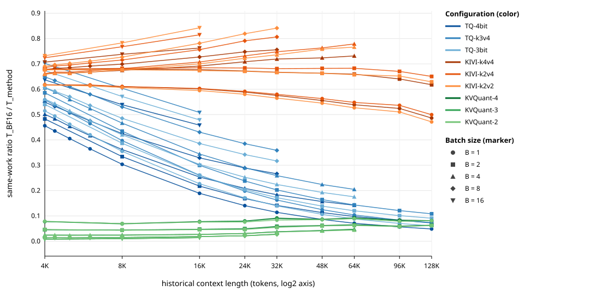

# Bytes Are Not Latency: Allocated Size, Measured Traffic, Decode Speed, and Quality of KV-Cache Quantization on a Single Blackwell GPU

## Abstract

KV-cache quantization is usually motivated by two expectations: a smaller cache, and faster decoding because decode is memory-bound. We test both, together with model quality, for adapted implementations of TurboQuant, KIVI, and KVQuant integrated into one full-model decode harness for Llama-3.1-8B-Instruct on a single NVIDIA RTX PRO 6000 Blackwell GPU. Ten configurations (BF16 and three settings per method) passed common numerical, memory, execution-path, CUDA Graph, and repeatability gates and were measured on a 534-point batch-by-context grid (441 feasible points) with five independent processes per point. Allocated compression is below nominal compression for every configuration (for example, 5.16× versus 8× for KIVI k2v2 at 128K tokens), and cache-path DRAM traffic at a common profiled point is 2.8–5.5× lower than BF16. Yet no compressed configuration is faster than BF16 at any of the 357 same-work points: wall-clock speedups range from 0.008 to 0.842. The CUDA Graph effect is method-specific, and the preregistered pure launch-floor interpretation is not supported. A method-conditioned knee model in batch, context, and allocated ratio is the best deployable candidate but misses all four predictive targets and fails when extrapolating BF16 to the batch edge. Under a staged, cache-sensitive quality protocol restricted to physical batch size 1, eight of nine compressed configurations fail and one is inconclusive. KIVI k4v4 passes Full perplexity and LongBench-E but fails two LongBench v2 guardrails, so no configuration is both quality-qualified and faster than BF16.

## 1 Research questions and motivation

During autoregressive decoding every new token attends over the full key–value (KV) cache, so at long context the cache dominates both device memory and per-step memory reads. For Llama-3.1-8B-Instruct [24], one 128K-token sequence holds 17.2 GB of BF16 keys and values. KV-cache quantization stores this state in a few bits per element [1–3, 8–10, 13, 17, 18, 21] and is expected to deliver two benefits: capacity, because more tokens fit in memory, and speed, because a bandwidth-bound decode step should shorten when it reads fewer bytes.

The speed argument rests on a chain of proxies—nominal bit width, allocated bytes, physical DRAM traffic, latency—and each link can break. Allocated storage includes scales, norms, full-precision windows, sparse outliers, and workspace; traffic depends on what kernels actually read; latency depends on how much parallelism kernels expose and how many kernels the host submits. A quality claim further requires that the model behaves well when it must read its compressed cache. Published evaluations measure these links with each method's own harness and hardware, and a serving-oriented re-examination notes that KV-cache compression remains uncommon in production [4].

We study three methods that stress different links. TurboQuant rotates vectors and applies scalar codebooks, giving a dense packed layout of fixed size [3]. KIVI quantizes keys per channel and values per token and keeps a recent window in full precision, so its effective ratio varies with context [2]. KVQuant quantizes pre-RoPE keys with sensitivity-weighted non-uniform datatypes, stores outliers sparsely, and keeps the first tokens in FP16 as attention sinks [1, 6]. We ask four questions:

- RQ1 (bytes). How do nominal bit width, allocated cache bytes, and measured DRAM traffic relate for each method, and does any validated path materialize grouped-query K/V at query-head width?
- RQ2 (latency). Does a smaller cache yield same-work decode speedup on this GPU, and is the sensitivity of the latency curve to CUDA Graphs explained by launch overhead alone?
- RQ3 (prediction). Is a method-conditioned function of batch size B, context length L, and allocated ratio r sufficient to predict decode latency for held-out batches, configurations, and context bands?
- RQ4 (quality). Which compressed configurations preserve quality when evaluation reads the compressed cache, and what survives a joint quality–performance validation?

*Related work.* Most KV-cache quantizers refine how bits are spent across tokens and channels: importance-aware mixed precision [17], salient-token identification [10], sliding-window quantization [13], near-lossless compression recipes [9], subspace-orthogonal quantization [18], hardware-aware tuning-free quantization [21], and 1-bit quantized Johnson–Lindenstrauss transforms [8]. These papers report accuracy and efficiency in their own harnesses; we measure three of them with model, hardware, timing boundary, and evaluation held fixed. Rotation-based outlier suppression [11, 23] is related to the Hadamard rotation that TurboQuant's vLLM implementation applies to keys. Low-rank projection [14] compresses the hidden dimension of cached keys and values, an axis orthogonal to bit width that we leave aside. Eviction and selection methods [5, 7, 12, 15, 19, 20] shrink the cache along the token axis; KVQuant's FP16 sink tokens follow the attention-sink observation of [6]. Serving-oriented work compresses KV caches for streaming and transfer between machines [16, 22], and Gao et al. [4] revisit compression techniques from the perspective of production serving. We complement these with controlled same-work decode timing on one GPU.

## 2 Experimental scope and measurement methodology

### 2.1 System under test

All experiments use Llama-3.1-8B-Instruct at one fixed revision with BF16 weights: 32 layers, 32 query heads sharing 8 KV heads through grouped-query attention [25], and head dimension 128. The hardware is one NVIDIA RTX PRO 6000 Blackwell GPU (96 GB, compute capability 12.0) with tensor parallelism 1. All timing runs execute in one digest-pinned container with PyTorch 2.12.1 and CUDA 13.0 [26]. The BF16 baseline calls PyTorch scaled-dot-product attention restricted to its FlashAttention backend with native GQA [27]; an unsupported shape raises an error. Caches are static, preallocated, and stored at eight KV heads; `torch.compile` is disabled.

### 2.2 Methods and implementation provenance

Every compressed method runs from adapted code (Table 1).

Table 1. Configurations and implementation sources.

| Family | Configurations (key/value bits) | Implementation source | Project changes |
|---|---|---|---|
| BF16 | BF16 | PyTorch SDPA, FlashAttention backend | none |
| TurboQuant | TQ-4bit (4/4), TQ-k3v4 (3/4), TQ-3bit (3/3) | TurboQuant KV-cache path of vLLM v0.25.1 | port into the common harness |
| KIVI | k4v4, k2v4, k2v2; group 32, residual 32 | official repository, post-paper snapshot | native-GQA residual patch; FP16 staging |
| KVQuant | KVQuant-4, -3, -2; 5 sink tokens; outlier cap 12 | author repository | GQA/RoPE compatibility; graph-safe, deterministic kernels |

*TurboQuant.* The paper names no author implementation, so we use the TurboQuant path of vLLM v0.25.1 [28]. It applies a Hadamard rotation and Lloyd–Max scalar quantization to keys with a per-vector FP16 norm, quantizes values uniformly with FP16 scale and zero point, omits the paper's QJL stage [8], and keeps the first two and last two attention layers in BF16.

*KIVI.* We use the official repository at a post-paper snapshot that advertises Llama-3/GQA support, with group size 32 and a 32-token full-precision residual window (the paper's main experiments mostly use 128; its appendix reports 32). The snapshot's residual-window attention expands K/V from 8 to 32 heads (Section 3.5). Our patch groups query heads by their KV head and computes both residual contractions over the eight KV heads; it matches the original formula exactly in BF16 checks and leaves quantization, packing, metadata, and rollover unchanged. The official CUDA kernels accept only FP16, so BF16 activations are staged through preallocated FP16 buffers.

*KVQuant.* We use the author repository with a compatibility patch ("KVQuant-GQA patched upstream"), because the pinned revision rejects Llama-3.1 RoPE and native GQA. The patch adds both, plus a project-defined sparse-outlier capacity of 12 entries per token row (six per tail of the 1,024-wide KV row), deterministic tie-breaking, and five FP16 sink tokens; the harness supplies pre-RoPE keys. To pass our allocation, determinism, and graph gates, we also replaced dynamic allocation and host synchronization in sparse selection and value packing with fixed caller-owned buffers, replaced floating-point atomics in long-context value decode with per-tile partials and an ordered reduction, and initialized shared-memory lanes that the original value kernels read uninitialized. Quantizers, packing, and sparse semantics are unchanged. Calibration uses sixteen 2,048-token WikiText-2 training windows [29] with Fisher-weighted non-uniform quantizers.

### 2.3 Decode endpoint and timing

The primary runner fixes the historical context L, builds the cache outside timing, and replays one decode step as a CUDA Graph at unchanged shape. A step embeds one token per sequence, runs all 32 layers against the cache, and applies the final norm and LM head to produce full-vocabulary logits. Sampling is excluded, and the measured region contains no allocation, concatenation, host synchronization, or tensor-to-host conversion. Latency is the wall-clock time of one full-batch decode step, observed on the host. Each process runs 64 warmup and 256 measured steps. A point's latency is the median of five process medians, and points whose cross-process coefficient of variation (CV) exceeds 3% are marked unstable. CUDA-event time serves as a secondary diagnostic. Points run in blocked randomized order, with block order rotated across the five process repetitions. We write the largest context, 131,071 historical tokens plus the current one, as 128K.

### 2.4 Validation and scan

A configuration entered the scan only after passing five shared gates at B = 1, L = 4,096, Graph mode: agreement with its own method's reference implementation (G1); predicted and allocated bytes within 1% (G2); a clean execution path, with no dequantized full-precision copy of the cache prefix, GQA repeat materialization, measured-region allocation or host synchronization, or backend fallback (G3); correct graph replay without allocation (G4); and three-process repeatability (G5). Each method's kernels also passed reference-fixture, Compute Sanitizer, and allocation tests. All ten configurations passed.

A three-process pilot located provisional knees. Because knee density was insufficient for 25 of 30 curves, a separately preregistered densification step added 84 contexts before the full scan. The full scan covers B ∈ {1, 2, 4, 8, 16} and nine base contexts from 4K to 128K for all ten configurations, plus the 84 adaptive points: 534 points. Feasibility was predicted before launch against 88% of device memory; 441 points are feasible and 93 are recorded as capacity-infeasible. All 441 feasible points were measured in five processes each and are stable (maximum CV 1.31%); Appendix A gives the run accounting.

### 2.5 Bytes, traffic, and comparison types

We separate three compression ratios. The nominal ratio is r_nom = [f + (1 − f)(q_K + q_V)/32]^(−1), where q_K and q_V are the configured key and value bit widths and f is the fraction of layers kept in BF16 (4/32 for TurboQuant, 0 otherwise). The allocated ratio is r_alloc = C_logical / C_alloc, where C_logical is the logical BF16 K/V payload at (B, L) and C_alloc is the storage a configuration actually allocates, including metadata, residual, sink, outlier, padding, and workspace bytes; for BF16 itself r_alloc is slightly below 1 because of a small workspace. The measured ratio is r_DRAM = D_BF16 / D_method, where both are DRAM bytes (GDDR7 on this GPU) that Nsight Compute [30] measures for cache-path kernels; r_DRAM exists only where a profiler measured it, and timing analysis excludes profiler durations. Traffic amplification is A = (D_method / D_BF16) / (C_alloc,method / C_alloc,BF16), computed against BF16's actual allocation; A exceeds 1 when a method moves more bytes than its allocation implies.

A same-work ratio S = T_BF16 / T_method compares identical B, L, output work, graph mode, and timing boundary; S < 1 means the method is slower. A capacity-amplification point is one where the method is feasible and BF16 is not. It has no latency denominator, and we report the two comparison types separately.

## 3 Allocated bytes, measured traffic, and decode behavior

### 3.1 Nominal versus allocated compression

Table 2. Nominal and allocated compression at B = 1, and the main sources of compression shortfall at 128K (logical BF16 K/V payload: 17.18 GB).

| Configuration | r_nom | r_alloc, 4K | r_alloc, 128K | Main sources of compression shortfall at 128K (GB) |
|---|---:|---:|---:|---|
| TQ-4bit | 2.91 | 2.22 | 2.23 | BF16 boundary layers 2.15; decode workspace 1.62 |
| TQ-k3v4 | 3.16 | 2.37 | 2.38 | same as TQ-4bit |
| TQ-3bit | 3.46 | 2.53 | 2.54 | same as TQ-4bit |
| KIVI-k4v4 | 4.00 | 3.04 | 3.14 | scale/zero metadata 1.07 |
| KIVI-k2v4 | 5.33 | 3.75 | 3.90 | scale/zero metadata 1.07 |
| KIVI-k2v2 | 8.00 | 4.88 | 5.16 | scale/zero metadata 1.07 |
| KVQuant-4 | 4.00 | 3.08 | 3.14 | sparse outliers 0.81; metadata 0.30 |
| KVQuant-3 | 5.33 | 3.98 | 4.05 | sparse outliers 0.81; metadata 0.17 |
| KVQuant-2 | 8.00 | 5.44 | 5.54 | sparse outliers 0.81; metadata 0.10 |

Allocated compression is below nominal for every configuration, and both the gap and its dependence on context are method-specific (Table 2). TurboQuant's ratio is nearly flat in L because its BF16 boundary layers and decode workspace both scale with context. KIVI's ratio rises with context as the fixed 32-token window amortizes, but its per-group scale and zero-point metadata alone occupy 1.07 GB at 128K. KVQuant's sparse outlier storage has fixed capacity per token, so it is identical across bit widths (0.81 GB at 128K) and weighs more as the dense payload shrinks. Nominal bit width therefore overstates compression by a configuration-dependent margin and cannot stand in for allocated bytes.

### 3.2 Measured DRAM traffic

Nsight Compute profiled all ten configurations at one common geometry: B = 1, 128K, Graph mode (Table 3).

Table 3. Profiled DRAM traffic at B = 1, 128K, Graph mode, and the same-work ratio from normal timing at the same point.

| Configuration | Cache-path DRAM (GB) | Total decode DRAM (GB) | r_alloc | r_DRAM | A | S (normal timing) |
|---|---:|---:|---:|---:|---:|---:|
| BF16 | 17.38 | 32.50 | 1.00 | 1.00 | 1.00 | — |
| TQ-4bit | 6.25 | 21.38 | 2.23 | 2.78 | 0.80 | 0.048 |
| TQ-k3v4 | 5.75 | 20.88 | 2.38 | 3.02 | 0.79 | 0.072 |
| TQ-3bit | 5.19 | 20.32 | 2.54 | 3.35 | 0.76 | 0.060 |
| KIVI-k4v4 | 6.18 | 23.08 | 3.14 | 2.81 | 1.12 | 0.486 |
| KIVI-k2v4 | 5.10 | 22.01 | 3.90 | 3.41 | 1.15 | 0.499 |
| KIVI-k2v2 | 4.03 | 20.94 | 5.16 | 4.31 | 1.20 | 0.471 |
| KVQuant-4 | 4.54 | 25.21 | 3.14 | 3.82 | 0.82 | 0.081 |
| KVQuant-3 | 3.78 | 23.61 | 4.05 | 4.60 | 0.88 | 0.081 |
| KVQuant-2 | 3.16 | 22.45 | 5.54 | 5.50 | 1.01 | 0.081 |

Allocation and traffic disagree in both directions. TurboQuant moves fewer bytes than its allocation implies (A = 0.76–0.80), while KIVI moves more (A = 1.12–1.20); the available KIVI kernel symbols do not isolate residual-copy traffic, so the excess remains unattributed.

Table 3 also shows that every compressed configuration transfers 2.8–5.5× fewer cache bytes than BF16, and 20.3–25.2 GB in total against BF16's 32.5 GB, yet all are slower (S = 0.048–0.499). Cache traffic volume alone therefore does not determine latency in these implementations. BF16 has an L2 hit rate of 3.2%, SM activity of 15.8%, and achieved occupancy of 11.1%. TurboQuant keeps very little of the GPU busy (SM activity 3.3–5.4%, occupancy about 2.5%) despite L2 hit rates of 40–44%. KVQuant is slower than BF16 despite higher SM activity (26.6–27.4%) and occupancy (28.6–30.4%), and its step adds sparse value, index, and metadata kernels and the ordered tile reductions of Section 2.2.

### 3.3 Same-work decode latency

Table 4. Wall-clock latency per full-batch decode step (ms), median of five process medians.

| Configuration | B=1, 4K | B=1, 32K | B=1, 128K | B=8, 4K | B=8, 32K | B=16, 4K |
|---|---:|---:|---:|---:|---:|---:|
| BF16 | 11.77 | 14.12 | 22.29 | 14.28 | 32.67 | 17.30 |
| TQ-4bit | 25.83 | 123.92 | 460.22 | 26.02 | 122.72 | 27.16 |
| TQ-k3v4 | 21.09 | 86.82 | 309.89 | 22.02 | 91.10 | 24.65 |
| TQ-3bit | 22.88 | 101.21 | 369.84 | 23.52 | 103.14 | 25.66 |
| KIVI-k4v4 | 19.06 | 24.53 | 45.83 | 21.06 | 43.23 | 24.47 |
| KIVI-k2v4 | 19.08 | 24.34 | 44.63 | 20.84 | 40.51 | 23.88 |
| KIVI-k2v2 | 19.10 | 24.99 | 47.31 | 20.68 | 38.83 | 23.63 |
| KVQuant-4 | 151.08 | 154.41 | 273.86 | 1,077.92 | 1,172.11 | 2,153.59 |
| KVQuant-3 | 152.12 | 158.56 | 275.05 | 1,078.92 | 1,186.79 | 2,173.71 |
| KVQuant-2 | 149.27 | 169.47 | 275.64 | 1,065.92 | 1,232.51 | 2,105.69 |

At all 357 points where BF16 and a compressed configuration were measured with identical work, the same-work ratio is below 1 (Figure 1). By family, S spans 0.471–0.842 for KIVI, 0.048–0.702 for TurboQuant, and 0.008–0.092 for KVQuant. Another 123 candidate pairs have no ratio: in 108 BF16 is capacity-infeasible, and 15 are adaptive contexts with no exact BF16 counterpart. Of the 108, the 27 with a feasible compressed configuration are the capacity points of Section 3.4; in the other 81 both sides are infeasible.

The families differ in shape (Table 4). KIVI is closest to BF16; it adds about 7 ms at B = 1, 4K, and its ratio improves with batch size, peaking at 0.842 (k2v2). TurboQuant's step time grows steeply with context but barely changes with batch at fixed L (TQ-4bit at 32K: 123.9 ms at B = 1, 122.7 ms at B = 8), and it is not monotone in bit width: TQ-k3v4 is the fastest of the three. We hypothesize that its decode kernels expose too little parallelism at B = 1 to fill the GPU, which is consistent with the 3.3–5.4% SM activity and roughly 2.5% occupancy at the profiled point: additional sequences would then occupy otherwise idle SMs at little cost, while each additional context token lengthens the per-sequence work. KVQuant costs about 150 ms already at B = 1, 4K and grows almost proportionally with batch (151, 1,078, and 2,154 ms at B = 1, 8, and 16), while BF16 goes from 11.8 to 17.3 ms over the same range. This pattern is consistent with per-sequence serialization: our KVQuant adapter launches the key and value decode kernels, and the per-step packing kernels, once per sequence on batch-1 slices, and graph capture on a single stream preserves that order.



Figure 1. Wall-clock same-work ratio T_BF16 / T_method versus historical context in Graph mode, one line per compressed configuration (color) and batch size (marker). Every ratio is below 1.

### 3.4 Capacity

Compression does buy capacity, at the margin of this grid. At B·L = 393,216 tokens (B = 4 at 96K, B = 8 at 48K, B = 16 at 24K), BF16's predicted end-to-end peak of 114.3–114.4 GB, which includes prefix construction and graph capture, exceeds the 89.7 GB limit, while all nine compressed configurations fit at 72.1–86.0 GB. These 27 capacity-amplification points carry no speedup claim because BF16 has no latency there.

### 3.5 GQA materialization

Expanding K/V from 8 to 32 heads creates operands four times larger than the stored cache. Source audits, operator traces, allocation audits, and profiler kernel classification found such expansion only outside the validated system. Generic reference attention paths expand K/V: Transformers' eager attention calls `repeat_kv`, and a same-shape math-SDPA control dispatched `expand` and `clone`, so we excluded both as the baseline. The residual-window attention of the official KIVI snapshot also produced a contiguous 32-head copy with four times the input storage at our geometry, which we patched (Section 2.2). Every validated configuration passed the G3 materialization check, and at the profiled point Nsight Compute found no complete-prefix materialization or query-head-expanded K/V signature. Fourfold expansion is therefore a property of particular code paths, not of GQA decoding in general; we make no claim about how common it is elsewhere.

### 3.6 Launch overhead and CUDA Graphs

Fixed-L latency curves are often described by a floor, a knee, and a post-knee slope, and a natural hypothesis is that the floor is launch overhead that CUDA Graphs [31] remove. We tested this in a dedicated eager-versus-Graph experiment that compares the two modes within a configuration and shape. It covered all ten configurations at B ∈ {1, 4} and six contexts from 4K to 128K, with three processes per mode; of 120 conditions, the 105 stable ones enter the fitted comparisons (Appendix A).

The preregistered pure launch-floor interpretation requires that under Graph mode the fitted floor drops materially (ratio ≥ 1.05), the post-knee slope stays within [0.8, 1.2] of eager, a host-minus-device timing proxy decreases, and outputs and kernel paths are unchanged. It holds in 0 of 14 fully identifiable comparisons; four more are inconclusive because of unstable eager data, and two have no positive eager slope. The failures are method-specific (Figure 2). For KIVI, Graph mode lowers the fitted floor about tenfold (ratio 9.8–10.3) but also changes the slope (ratio 0.29–0.31 at B = 1) and moves the knee by −61,440 tokens. For TurboQuant, floors drop modestly (1.05–1.59) with similar slopes, but the timing proxy does not decrease. For KVQuant, neither floor nor slope changes materially.

Nsight Systems [32] shows what Graph mode removes for four anchor configurations (BF16, TQ-4bit, KIVI-k4v4, KVQuant-4). In the traced window, eager execution issued 10,832 CUDA API calls for BF16, 12,400 for TurboQuant, 54,608–63,312 for KIVI, and 53,328 for KVQuant; Graph mode replaced them with eight graph launches. GPU inter-kernel idle time fell in all 16 anchor pairs, with kernel count and order unchanged. Graph mode thus removes submission overhead and idle gaps for every method, but how much that reshapes the latency curve depends on the method.


Figure 2. Eager-to-Graph latency ratio versus context for each configuration at B = 1 and B = 4 (within-configuration mechanism experiment). KIVI's ratio starts near 10 and declines with context. BF16 starts near 2. TurboQuant and KVQuant stay close to 1.

## 4 Method-conditioned B/L/r modeling and generalization limits

### 4.1 Candidates and protocol

The modeling data are the 2,205 wall-clock process medians at the 441 feasible points, weighted equally per point. The selected model, D, is a knee surface fit separately for each family (BF16, TurboQuant, KIVI, KVQuant):

T(B, L, r) = τ(B, r) + s(B, r) · max(L / L_max − λ(B, r), 0), with L_max = 131,071.

Each of τ, s, and λ is a function of standardized log B and log r_alloc through the basis {1, z_B, z_r, z_B·z_r}; τ and s are exponentiated to stay positive and λ lies in (0.02, 0.98), giving 12 coefficients per family. r_alloc is computed at each (B, L) from the byte accounting of Section 2.5, so KIVI's context-dependent ratio enters directly. Fits minimize mean squared log latency with a small ridge penalty. The alternatives are E, a quadratic in the scalar log(B·L / r_alloc), i.e., the byte law; Surface, a quadratic in log B, log L, and log r; F_shape, D plus byte-composition fractions; and F_diagnostic, which adds the observed kernel count and is not deployable.

Four holdout protocols were used: leave one batch size out, leave one compressed configuration out within a family (not applicable to BF16), leave the 24K–48K context band out, and run-to-run repeatability (one of the five process sessions held out). The first three define 11 applicable (protocol, family) cells. Among the deployable candidates, the selection rule, fixed in advance, takes the lowest macro mean of cell median relative errors, then the lowest macro mean of cell P95 errors, then fewer coefficients. The targets were median ≤ 5%, P95 ≤ 10%, same-work sign accuracy ≥ 95%, pairwise ranking accuracy ≥ 90%, and knee error ≤ 10%. Selection uses the same outer holdouts on which we report error, with no nested loop, so the reported scores of the selected model do not account for the selection step.

### 4.2 Results

Table 5. Candidate scores. Each value is the mean, over the 11 geometry-holdout cells, of the per-cell median or P95 relative error.

| Candidate | Coefficients per family | Macro median rel. error | Macro P95 rel. error | Deployable |
|---|---:|---:|---:|---|
| E (scalar byte law) | 3 | 34.6% | 122.2% | yes |
| Surface | 10 | 14.2% | 56.5% | yes |
| D (selected) | 12 | 7.9% | 164.5% | yes |
| F_shape | 24 | 8.4% | 60.8% | yes |
| F_diagnostic | 27 | 7.6% | 30.0% | no |

Table 6. Model D held-out relative error, median / P95.

| Protocol | BF16 | TurboQuant | KIVI | KVQuant |
|---|---|---|---|---|
| Leave one batch out | 3.9% / 1,625.7% | 7.8% / 23.1% | 8.2% / 20.7% | 6.2% / 11.7% |
| Leave one configuration out | n/a | 29.9% / 44.6% | 2.9% / 14.1% | 4.7% / 16.2% |
| Leave context band out | 1.8% / 2.4% | 9.7% / 21.9% | 4.9% / 16.2% | 7.3% / 13.3% |
| Run-to-run repeatability (not used for selection) | 1.2% / 3.9% | 7.9% / 22.0% | 3.5% / 11.8% | 4.5% / 10.0% |

E is far worse than every alternative on median error, so the scalar byte law we tested does not describe these data. Surface improves on E, and D improves again. F_shape has a slightly worse median than D (8.4% vs 7.9%) but a much better P95 (60.8% vs 164.5%); the selection rule ranks by median first and selects D. D has the worst macro P95 of the five (164.5%) because one cell dominates it: BF16 with a batch size held out has a P95 of 1,625.7%, while the other ten cells range from 2.4% to 44.6% (Table 6).

The selected model misses every evaluable target: macro median 7.9% (target 5%), macro P95 164.5% (10%), same-work sign accuracy 93.2% (425/456; 95%), and pairwise ranking accuracy 67.4% (346/513; 90%). Since every measured ratio is below 1, a constant "slower" predictor would score 100%, so sign accuracy is uninformative here. Knee error is not evaluable because no independent knee reference exists.

The BF16 tail is a genuine extrapolation failure. With B = 1 held out, D trained on B ∈ {2, 4, 8, 16} predicts 668.6 ms for BF16 at B = 1, 4K, where 11.77 ms was measured—a relative error of 5,579%. Over the 15 BF16 edge-extrapolation rows the median error is 21.5% and the P95 4,017%, against 2.5% and 6.0% for the 27 interior-interpolation rows. An audit confirmed units, joins, context scaling, and the point-dependent BF16 ratio; the prediction is reported unmodified and appears as the column of points at the far left of Figure 3. TurboQuant's latency is not monotone in r (Section 3.3), and holding out one TurboQuant configuration gives the weakest configuration transfer (29.9% median error).


Figure 3. Held-out predicted versus measured latency for model D over the three geometry holdout protocols (968 held-out predictions; both axes in ms on a log scale; red line y = x). The vertical column at the far left is the BF16 batch-edge extrapolation failure, which is retained.

### 4.3 Knees and scope

Of 50 configuration–batch curves, 23 have a knee identified within the measured range; 14 are weakly identified, 12 prefer a linear or constant description, and 1 has insufficient feasible span. Intervals come from 1,000 bootstrap draws over the five process sessions.

Within the measured domain D interpolates reasonably for these ten configurations: held-out context bands give median errors of 1.8–9.7%, and BF16 interior batch sizes give 2.5% median and 6.0% P95 error. Outside it—batch sizes at the grid edge, quantizers beyond the three measured per family, other models, GPUs, or serving systems—the model is unvalidated, and its 67% ranking accuracy makes it unsuitable for automatic method selection. The evidence favors method-conditioned B/L/r structure over a scalar byte law and leaves open whether B, L, and r are sufficient.

## 5 Cache-sensitive quality evaluation and scoped joint results

### 5.1 Protocol

Quality was evaluated after the performance data were frozen, on the same checkpoint, tokenizer, and method configurations. Every stage runs at physical batch size 1 in an eager, growing-context path that forces the model to read its compressed cache. Perplexity uses incremental teacher forcing after a prefix, so a decode step over the method's cache predicts every scored token. LongBench prompts prefill all but the final 16 prompt tokens, decode those 16 through the method, and then generate greedily. Token IDs, prompts, and the 16-token split are identical for BF16 and every method. All comparisons are paired, with 10,000 bootstrap draws clustered by document for perplexity and stratified by task (LongBench-E) or by length and category (LongBench v2).

Stages run in a fixed order, and a configuration advances only if it passes the previous stage: correctness checks; Fast perplexity; Full perplexity; LongBench-E; LongBench v2 without chain of thought (CoT) for per-method finalists; a CoT stress test for final recommended configurations; and joint validation. A secondary "native prefill" protocol, which prefills the whole prompt at once, applies to finalists only. Margins were fixed before any quality output: for perplexity, the paired 95% upper bound on ΔNLL stays below log(1.01) per dataset, with per-length review and hard-fail thresholds of 2% and 5%; for LongBench-E, the macro-drop upper bound is at most 2 points, with category thresholds of 3 (review) and 5 (hard) points and an invalid-output increase of at most 1 percentage point (pp). The LongBench v2 rules appear in Table 8.

Datasets are WikiText-2 test and a fixed C4 validation subset of 2,048 documents drawn from the first 4,096 rows [29, 33]; LongBench-E with 13 tasks and 3,668 samples [34]; and LongBench v2 with 503 frozen IDs, 321 of which fit the model's length under the no-CoT budget [35].

### 5.2 Protocol history

The quality protocol changed in documented steps. Its stages, gates, and margins were written before any performance measurement. The exact inputs (dataset revisions, sample IDs, prompt and chat-template hashes) and several mechanical choices (bootstrap size and resampling units, the bounded C4 frame, length buckets, the CoT subset and budgets) were fixed after performance results were known and before any quality output. The original protocol made batch invariance (B = 1 versus B ∈ {4, 8}) a correctness gate, and all ten configurations, BF16 included, failed it (Section 5.3). After that failure and before any perplexity score was computed, the protocol was amended to restrict formal quality evaluation to physical B = 1. The amendment records the cross-batch gate as failed, keeps every margin, dataset, sample, tokenization, and statistic, and states that B = 1 quality does not transfer to B > 1. Appendix B gives dates.

### 5.3 Correctness and batch-shape sensitivity

All ten configurations pass seven growing-context probes (L = 512 to 130,560), the 16-token LongBench suffix check, finite-output checks, and eager/Graph invariance at the fixed-L shape (100 of 100 tokens, zero maximum logit difference). The nine compressed configurations also pass cache-dependence controls: perturbing encoded storage changes the output, and intercepting the decode path stops the run.

All ten fail batch invariance, with maximum absolute logit errors from 0.34 (BF16, B = 4) to 3.03 (KIVI-k2v2, B = 4) against a tolerance of 0.02 absolute plus 0.02 relative. For BF16, a diagnosis found identical inputs and embeddings and identical outputs for duplicated rows within a batch; the first difference appears at the layer-0 query or value projection, pointing to shape-dependent BF16 projection arithmetic. The compressed configurations were not diagnosed separately. All configurations and the performance scan share these projections, so outputs at B > 1 can differ numerically from B = 1. The timings at B > 1 remain valid measurements of these paths; only the quality results are limited to B = 1.

### 5.4 Perplexity

Table 7. Perplexity versus BF16. Fast: 128 anchors and 16,384 scored tokens per configuration, at prefixes of 4K, 24K, 32K, and 64K. Full: 1,024 anchors and 262,144 scored tokens per configuration, at eight prefixes from 4K to 130,560. Intervals are paired 95% CIs on ΔNLL.

| Configuration | Fast ΔNLL [95% CI] | Fast rel. PPL | Fast status | Full status |
|---|---:|---:|---|---|
| TQ-4bit | 0.0103 [0.0078, 0.0128] | +1.03% | INCONCLUSIVE | not run |
| TQ-k3v4 | 0.0339 [0.0289, 0.0392] | +3.45% | FAIL | not run |
| TQ-3bit | 0.0389 [0.0337, 0.0442] | +3.97% | FAIL | not run |
| KIVI-k4v4 | 0.0016 [0.0005, 0.0028] | +0.17% | PASS | PASS |
| KIVI-k2v4 | 0.0367 [0.0316, 0.0421] | +3.74% | FAIL | not run |
| KIVI-k2v2 | 0.0434 [0.0376, 0.0494] | +4.43% | FAIL | not run |
| KVQuant-4 | 3.397 [3.297, 3.500] | +2,888% | FAIL | not run |
| KVQuant-3 | 3.387 [3.288, 3.489] | +2,859% | FAIL | not run |
| KVQuant-2 | 3.411 [3.319, 3.506] | +2,930% | FAIL | not run |

KIVI-k4v4 passes Fast perplexity and then passes Full perplexity on both datasets: +0.174% on WikiText-2 (ΔNLL 0.00174, CI [0.00123, 0.00224]) and +0.182% on C4 (0.00182, [0.00115, 0.00257]). No dataset–length cell crosses the review threshold; the largest is +0.35%. The aggregate interval for TQ-4bit straddles the 1% margin (relative PPL CI [+0.78%, +1.29%]), so its Fast status is INCONCLUSIVE; no extension sample was run and it did not advance. The other seven configurations fail.

The KVQuant result is extreme: perplexity rises about thirtyfold, consistently across both datasets and all four lengths in the paired per-anchor data. These configurations produce finite outputs, pass cache-dependence controls, and match their method's reference fixtures, so the degradation is not a crash or numerical overflow. Its cause is undetermined. The degradation belongs to these integrated configurations—the GQA port, project-defined outlier capacity, deterministic kernels, and 16-window calibration of Section 2.2—and should not be attributed to KVQuant implementations in general.

### 5.5 LongBench-E

On 3,668 paired samples, the equal-task macro score is 54.381 for BF16 and 54.249 for KIVI-k4v4: a drop of 0.132 points with paired 95% CI [−0.291, 0.545], well inside the 2-point margin. Category drops range from −0.73 to +0.78 points, length-bucket drops from 0.02 to 0.22 points, and neither method produced an invalid output. KIVI-k4v4 passes LongBench-E.

### 5.6 LongBench v2

Table 8. LongBench v2 (no CoT, 8-token answer budget), BF16 versus KIVI-k4v4 on 321 paired questions. Drops are in percentage points.

| Subset | N | BF16 correct | k4v4 correct | Drop [95% CI] |
|---|---:|---:|---:|---:|
| Overall | 321 | 94 (29.3%) | 89 (27.7%) | 1.56 [−0.31, 3.43] |
| Single-document QA | 126 | 43 | 40 | 2.38 [−0.79, 6.35] |
| Multi-document QA | 90 | 29 | 28 | 1.11 [0.00, 3.33] |
| Long in-context learning | 41 | 10 | 10 | 0.00 [−9.76, 9.76] |
| Long-dialogue history | 39 | 4 | 4 | 0.00 [0.00, 0.00] |
| Code repository understanding | 15 | 7 | 6 | 6.67 [0.00, 20.00] |
| Long structured data | 10 | 1 | 1 | 0.00 [0.00, 0.00] |

| Criterion | Observed | Rule | Result |
|---|---|---|---|
| Overall non-inferiority | upper bound 3.43 pp | ≤ 2 pp | INCONCLUSIVE |
| Category guardrail | code: 6.67 pp, N = 15 | every category ≤ 5 pp | FAIL |
| Length guardrail | max 3.57 pp (8–16K, N = 28) | every bucket ≤ 5 pp | PASS |
| Invalid-output increase | +0.31 pp (24 → 25) | ≤ 1 pp | PASS |
| BF16-correct retention | 86/94 = 91.5%, CI [85.6%, 96.6%] | point estimate ≥ 95% | FAIL |

The overall interval includes zero but extends past the 2-pp margin, so overall non-inferiority is inconclusive. The combined gate fails on two guardrails. In the code repository understanding category, which has only N = 15 questions, BF16 answers 7 correctly and KIVI-k4v4 answers 6: a 6.67-pp drop with 95% CI [0.0, 20.0] pp, produced by a net difference of one answer. And KIVI-k4v4 retains 86 of the 94 questions BF16 answers correctly (91.5%), below the 95% guard; the paired table has 8 correct-to-wrong and 3 wrong-to-correct changes (n11/n10/n01/n00 = 86/8/3/224). Both failures come from fixed rules applied to small discordant counts; the estimated overall drop is 1.56 pp. Most answers hit the 8-token budget (253 and 256 of 321), and 24 and 25 outputs were invalid, including 20 of 39 per method in the long-dialogue category; both methods share these conditions, and their role in the failure is unknown.

### 5.7 Joint outcome

Table 9. Joint outcome at physical B = 1. "Not run" marks stages a configuration never reached because an earlier stage did not pass.

| Configuration | Fast PPL | Full PPL | LongBench-E | LongBench v2 | Outcome |
|---|---|---|---|---|---|
| TQ-4bit | INCONCLUSIVE | not run | not run | not run | inconclusive |
| TQ-k3v4, TQ-3bit | FAIL | not run | not run | not run | fail |
| KIVI-k4v4 | PASS | PASS | PASS | FAIL | fail |
| KIVI-k2v4, KIVI-k2v2 | FAIL | not run | not run | not run | fail |
| KVQuant-4, -3, -2 | FAIL | not run | not run | not run | fail |

Of the nine compressed configurations, eight fail, one is inconclusive, and none is fully qualified under the evaluation protocol. The CoT stress stage and the native-prefill secondary evaluation were not run, since no finalist remained and the protocol applies both only to finalists. In the joined quality–performance table, the 600 planned runs at B = 1 carry configuration-level quality status, while the 2,070 planned runs at B > 1 lie outside the evaluated quality scope and carry no quality verdict (Appendix A). The qualified table is empty, so the best qualified configuration and its speedup are undefined; independently of quality, no same-work ratio exceeds 1.

## 6 Limitations, reproducibility, and conclusions

### 6.1 Limitations

*Scope.* One model, one GPU, one software stack, tensor parallelism 1, static batches, and fixed-L Graph decode. We do not measure prefill cost, continuous batching, queueing, multi-GPU execution, or a serving system.

*Implementations.* All compressed families run adapted code: the vLLM TurboQuant implementation without QJL and with BF16 boundary layers; a post-paper KIVI snapshot with a GQA patch and FP16 staging; and KVQuant with a GQA/RoPE patch, a project-defined outlier capacity, and our graph-safe, deterministic kernels. The latencies characterize these implementations on this GPU; faster kernels for the same algorithms may exist. Because our KVQuant adapter launches the decode and packing kernels once per sequence (Section 3.3), KVQuant's near-linear growth with batch size likely reflects this dispatch choice more than the algorithm. At B = 1 the per-sequence loop runs once, but the other adapter changes of Section 2.2 still apply.

*Traffic and mechanism.* Traffic was measured at one geometry, and we do not extend it to other points or attribute critical-path time to individual kernels. The host-minus-device quantity is a timing proxy for launch gaps.

*Modeling.* Beyond the limits in Section 4, fold-level coefficient vectors were not saved, so held-out predictions are tied to the stored out-of-fold table and the fitting code.

*Quality.* All quality evidence is at physical B = 1. Quality ran in an eager, growing-context path linked to the Graph fixed-L performance runs through configuration identity and exact-shape eager/Graph agreement. LongBench v2 used no CoT and an 8-token budget; subgroups are small and three subgroup retention intervals are undefined; the C4 subset comes from a bounded frame; and only one compressed configuration reached LongBench.

*Protocol.* The quality protocol fixed its exact inputs after the performance results and was amended once (Section 5.2), and the 84 adaptive contexts were derived from pilot data.

### 6.2 Reproducibility

Raw samples, configurations, and checksums for every run are retained, every exclusion carries a machine-readable reason, and CPU-only packages regenerate the modeling and joint quality–performance results (Appendix A).

### 6.3 Conclusions

On one Blackwell GPU running a full Llama-3.1-8B decode step, three KV-cache quantizers deliver only part of what their bit widths promise. Allocated compression falls short of nominal for method-specific reasons and cache-path traffic drops 2.8–5.5×, yet in these implementations none of this becomes same-work speedup: every compressed configuration is slower than BF16 FlashAttention at every comparable point, from modestly (KIVI, up to 0.842) to severely (KVQuant, at most 0.092). The latency surface is method-conditioned, CUDA Graphs act differently on each method, and a knee model in B, L, and r interpolates within held-out context bands (median error 1.8–9.7%) but meets none of its predictive targets. Capacity gains are real but confined to three (B, L) settings at the edge of the grid, and at batch size 1 only KIVI k4v4 passes perplexity and LongBench-E before failing two LongBench v2 guardrails. Each link—bit width, allocated bytes, measured traffic, same-work latency, and cache-sensitive quality—needs its own measurement.

## Acknowledgments

AI coding assistants were used for implementation support and manuscript drafting; the author reviewed all code, results, and text.

## References

[1] C. Hooper et al. KVQuant: Towards 10 Million Context Length LLM Inference with KV Cache Quantization. arXiv:2401.18079v6.
[2] Z. Liu et al. KIVI: A Tuning-Free Asymmetric 2bit Quantization for KV Cache. arXiv:2402.02750v2.
[3] A. Zandieh et al. TurboQuant: Online Vector Quantization with Near-optimal Distortion Rate. arXiv:2504.19874v1.
[4] W. Gao et al. Rethinking Key-Value Cache Compression Techniques for Large Language Model Serving. arXiv:2503.24000v1.
[5] Z. Zhang et al. H2O: Heavy-Hitter Oracle for Efficient Generative Inference of Large Language Models. arXiv:2306.14048v3.
[6] G. Xiao et al. Efficient Streaming Language Models with Attention Sinks. arXiv:2309.17453v4.
[7] Y. Li et al. SnapKV: LLM Knows What You are Looking for Before Generation. arXiv:2404.14469v2.
[8] A. Zandieh et al. QJL: 1-Bit Quantized JL Transform for KV Cache Quantization with Zero Overhead. arXiv:2406.03482v2.
[9] H. Kang et al. GEAR: An Efficient KV Cache Compression Recipe for Near-Lossless Generative Inference of LLM. arXiv:2403.05527v4.
[10] Y. He et al. ZipCache: Accurate and Efficient KV Cache Quantization with Salient Token Identification. arXiv:2405.14256v1.
[11] S. Ashkboos et al. QuaRot: Outlier-Free 4-Bit Inference in Rotated LLMs. arXiv:2404.00456v2.
[12] Z. Cai et al. PyramidKV: Dynamic KV Cache Compression based on Pyramidal Information Funneling. arXiv:2406.02069v4.
[13] H. Duanmu et al. SKVQ: Sliding-window Key and Value Cache Quantization for Large Language Models. arXiv:2405.06219v3.
[14] C.-C. Chang et al. Palu: KV-Cache Compression with Low-Rank Projection. arXiv:2407.21118v2.
[15] G. Xiao et al. DuoAttention: Efficient Long-Context LLM Inference with Retrieval and Streaming Heads. arXiv:2410.10819v1.
[16] Y. Liu et al. CacheGen: KV Cache Compression and Streaming for Fast Large Language Model Serving. arXiv:2310.07240v6.
[17] J. Y. Yang et al. No Token Left Behind: Reliable KV Cache Compression via Importance-Aware Mixed Precision Quantization. arXiv:2402.18096v1.
[18] H. Wang et al. SQuat: Subspace-orthogonal KV Cache Quantization. arXiv:2503.24358v2.
[19] A. Devoto et al. Expected Attention: KV Cache Compression by Estimating Attention from Future Queries Distribution. arXiv:2510.00636v1.
[20] V. Chari and B. Van Durme. Compactor: Calibrated Query-Agnostic KV Cache Compression with Approximate Leverage Scores. arXiv:2507.08143v2.
[21] S. M. Tayaranian Hosseini et al. InnerQ: Hardware-Aware Tuning-Free Quantization of KV Cache for Large Language Models. arXiv:2602.23200v2.
[22] Z. Liu et al. KVServe: Service-Aware KV Cache Compression for Communication-Efficient Disaggregated LLM Serving. arXiv:2605.13734v1.
[23] Y. Feng et al. Provable Quantization with Randomized Hadamard Transform. arXiv:2605.13810v1.
[24] A. Grattafiori et al. The Llama 3 Herd of Models. arXiv:2407.21783v3.
[25] J. Ainslie et al. GQA: Training Generalized Multi-Query Transformer Models from Multi-Head Checkpoints. arXiv:2305.13245v3.
[26] A. Paszke et al. PyTorch: An Imperative Style, High-Performance Deep Learning Library. arXiv:1912.01703v1.
[27] T. Dao. FlashAttention-2: Faster Attention with Better Parallelism and Work Partitioning. arXiv:2307.08691v1.
[28] W. Kwon et al. Efficient Memory Management for Large Language Model Serving with PagedAttention. arXiv:2309.06180v1. Software: vLLM v0.25.1, https://github.com/vllm-project/vllm.
[29] S. Merity et al. Pointer Sentinel Mixture Models. arXiv:1609.07843v1.
[30] NVIDIA. Nsight Compute Documentation. https://docs.nvidia.com/nsight-compute/ (accessed 2026-10-04).
[31] NVIDIA. CUDA Programming Guide, Section 4.2: CUDA Graphs. https://docs.nvidia.com/cuda/cuda-programming-guide/04-special-topics/cuda-graphs.html (accessed 2026-10-04).
[32] NVIDIA. Nsight Systems Documentation. https://docs.nvidia.com/nsight-systems/ (accessed 2026-10-04).
[33] C. Raffel et al. Exploring the Limits of Transfer Learning with a Unified Text-to-Text Transformer. arXiv:1910.10683v4.
[34] Y. Bai et al. LongBench: A Bilingual, Multitask Benchmark for Long Context Understanding. arXiv:2308.14508v2.
[35] Y. Bai et al. LongBench v2: Towards Deeper Understanding and Reasoning on Realistic Long-context Multitasks. arXiv:2412.15204v2.

## Appendix A: Reproducibility

The results were produced at repository commit 0641de4b. The study used model `meta-llama/Llama-3.1-8B-Instruct` at revision `0e9e39f249a16976918f6564b8830bc894c89659`. Performance runs used measurement container `sha256:059bc9be89387369d7de9e3e9b26d85b6e9902c41e7dbf002ebc45edd188fb7e`, and quality runs used its derivative `sha256:1d8056643bf001fb83ee19e6bb19ec93379c296f2be6ba02e907d0b2f4ecca32`. Performance data are identified by the tag `perf-freeze-20260917-83536c37-r1`. The hardware manifest, per-run configuration, raw samples, and five independent process measurements per point are retained under content-addressed roots with indefinite retention: full-scan wall-clock root `5605558b…`, profiler root `641fc02d…`, modeling root `05d5c4e8…`, and joint-results root `2d609efb…`. The KIVI and KVQuant source patches are stored in the repository with their manifests. Two CPU-only packages run without a GPU or network access: the modeling package (Python standard library only) regenerates the modeling audit, figures, and predictor examples, and the joint-results package (Python with pyarrow) regenerates the per-stage outcome table, the joined quality–performance table, and the empty table of qualified configurations byte-for-byte.

Run accounting. The full scan comprises 2,670 planned runs (534 points × 5 processes): 2,205 completed runs and 465 predicted capacity-infeasible. Thirty-eight runs were replaced after infrastructure failures, each linked to the run it replaces, and no valid, slow, or unstable observation was rerun; output checksums, kernel paths, and allocations agree across processes. In the eager-versus-Graph experiment, 10 of 120 conditions were predicted infeasible and 105 were stable; five eager conditions (three BF16, two TQ-3bit) exceeded the 3% CV threshold and were kept as unstable, excluded from fitted comparisons, and not rerun. The quality–performance join matches runs by exact configuration identity and retains all 2,670 planned runs, with no unmatched or duplicated identities.

Artifact availability. The code, configurations, and method patches are released at https://github.com/fzlzjerry/kvbench as release tag v1.0 (default branch) under the Apache-2.0 license; vendored and patched third-party code keeps its upstream terms, listed in the repository's NOTICE file. The protocol, decision records, and full research history are on the main branch at commit 0641de4b. The two CPU reproduction packages are released as GitHub Release assets. The raw measurements are available from the author on request. Model weights are gated under the Llama 3.1 Community License and are not redistributed.

Modeling package (Python standard library only), run from the package root:

```bash
python3 reproduce.py reproduce --package . --output <output_dir>
```

Joint quality–performance package (Python with pyarrow), run from the package root:

```bash
python3 reproduce.py --reproduce . --output <output_dir>
```

In both cases <output_dir> must not exist yet.

## Appendix B: Protocol timeline

| Date (2026) | Event |
|---|---|
| Jul 22 | Scope, model, and performance measurement protocol fixed; post-performance quality protocol (stages, gates, margins) preregistered |
| Jul 25–31 | Measurement container fixed; per-method and unified validation gates passed |
| Aug 22–26 | Pilot scan; knee-densification design (84 adaptive contexts) frozen and executed; an earlier blocked pilot attempt contributed no timing |
| Aug 26–30 | Eager/Graph mechanism experiment; profiler subset |
| Aug 31–Sep 16 | Full scan executed; wall-clock primary analysis completed; an earlier stopped scan attempt contributed no timing |
| Sep 16–17 | Modeling and CPU reproduction package |
| Sep 17–18 | Performance data frozen; exact quality inputs and mechanical choices fixed |
| Sep 19 | Correctness stage: all ten configurations fail cross-batch invariance; BF16 diagnosis |
| Sep 19 | Physical-B = 1 amendment approved, before any perplexity score |
| Sep 19–21 | Fast perplexity |
| Sep 21–27 | Full perplexity (KIVI-k4v4) |
| Sep 27–Oct 2 | LongBench-E (KIVI-k4v4) |
| Oct 2–4 | LongBench v2 no-CoT (KIVI-k4v4) |
| Oct 4 | Joint validation and scoped quality–performance join |

The first full-scan summary computed ratios from CUDA-event medians. A later append-only analysis re-derived the preregistered wall-clock statistics from the same raw files without rerunning any timing, and all timing numbers in this paper use wall-clock time.
