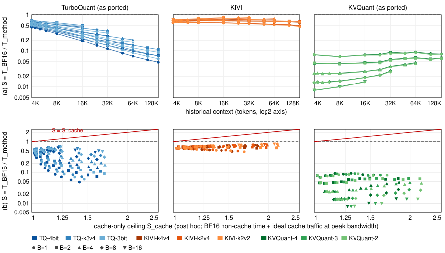
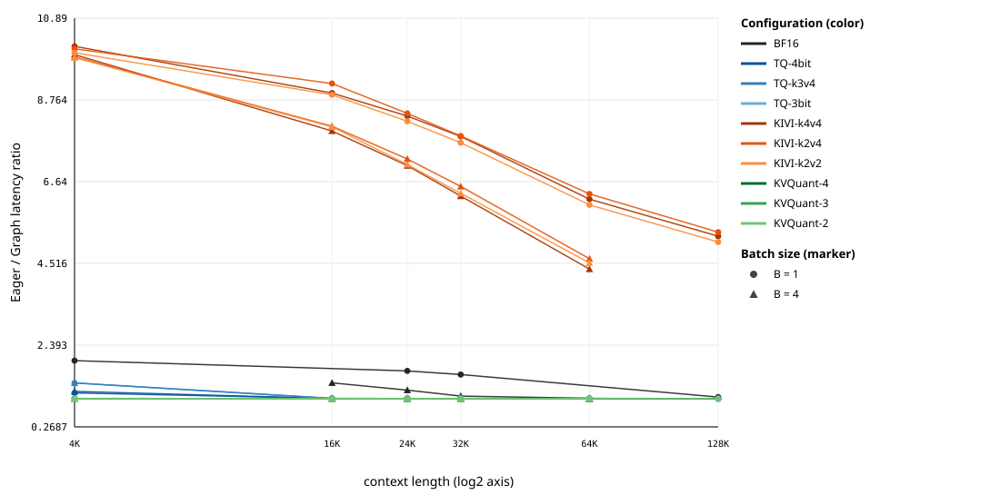
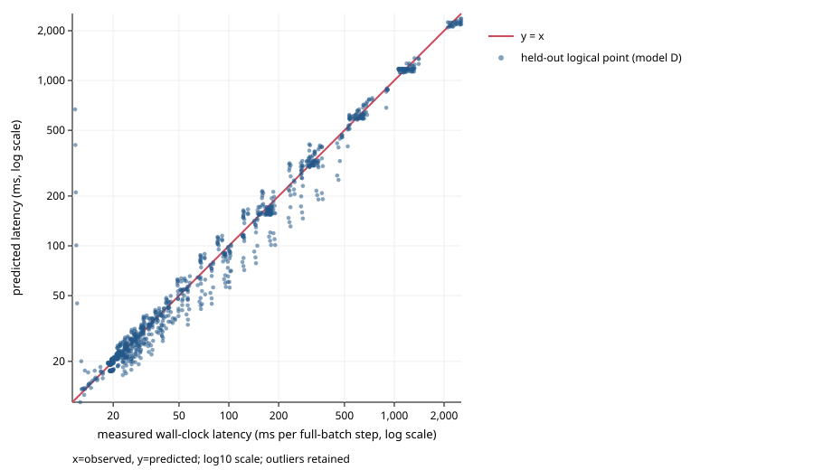

# Bytes Are Not Latency: Allocated Size, Measured Traffic, Decode Speed, and Quality of KV-Cache Quantization on a Single Blackwell Workstation GPU

## Abstract

KV-cache quantization is expected to speed up decoding because a memory-bound decode step should shorten when it reads fewer bytes. We test this expectation, together with model quality, for TurboQuant, KIVI, and KVQuant in one full-model Llama-3.1-8B-Instruct decode harness on an NVIDIA RTX PRO 6000 Blackwell GPU, and find that in these implementations fewer bytes do not mean lower latency: every compressed configuration moves fewer cache bytes than BF16, yet none is faster than BF16 FlashAttention at any same-work point. What decides latency is how efficiently the kernels move bytes, not how many they move. KIVI, the cleanest comparison because its cache-path kernels are the official ones, reads 2.8–4.3× fewer cache bytes than BF16 but runs its cache path at 8–13% of peak DRAM bandwidth at batch size 1, against 89% for BF16; even without our adapter's fixed overhead, KIVI at best matches BF16. The TurboQuant and KVQuant ports are slower still, and in all three methods large, identifiable costs trace to integration choices rather than to the algorithms: a split-KV setting below vLLM's default that leaves most of the GPU idle, a single-threaded outlier-selection kernel that we introduced to make KVQuant graph-safe and deterministic, and per-query-head residual kernels in our KIVI adapter; our correctness gates caught none of them. Modeled bandwidth ceilings bound what better kernels could gain, and under a cache-sensitive quality protocol for single-sequence decoding no configuration is both quality-qualified and faster than BF16.

## 1 Research questions and motivation

During autoregressive decoding every new token attends over the full key–value (KV) cache, so at long context the cache dominates both device memory and per-step memory reads. For Llama-3.1-8B-Instruct [24], one 128K-token sequence holds 17.2 GB of BF16 keys and values. KV-cache quantization stores this state in a few bits per element [1–3, 8–10, 13, 17, 18, 21] and is expected to deliver two benefits: capacity, because more tokens fit in memory, and speed, because a bandwidth-bound decode step should shorten when it reads fewer bytes.

The speed argument rests on a chain of proxies—nominal bit width, allocated bytes, physical DRAM traffic, latency—and each link can break. Allocated storage includes scales, norms, full-precision windows, sparse outliers, and workspace; traffic depends on what kernels actually read; latency depends on how much parallelism kernels expose and how many kernels the host submits. A quality claim further requires that the model behaves well when it must read its compressed cache. Published evaluations measure these links with each method's own harness and hardware, and a serving-oriented re-examination notes that KV-cache compression remains uncommon in production [4]; the exception is FP8 KV caching, which serving engines such as vLLM and TensorRT-LLM support [37, 38].

We study three methods that stress different links. TurboQuant rotates vectors and applies scalar codebooks, giving a dense packed layout of fixed size [3]. KIVI quantizes keys per channel and values per token and keeps a recent window in full precision, so its effective ratio varies with context [2]. KVQuant quantizes pre-RoPE keys with sensitivity-weighted non-uniform datatypes, stores outliers sparsely, and keeps the first tokens in FP16 as attention sinks [1, 6]. We ask four questions:

- RQ1 (bytes). How do nominal bit width, allocated cache bytes, and measured DRAM traffic relate for each method, and does any validated path materialize grouped-query K/V at query-head width?
- RQ2 (latency). Does a smaller cache yield same-work decode speedup on this GPU, and is the sensitivity of the latency curve to CUDA Graphs explained by launch overhead alone?
- RQ3 (prediction). Is a method-conditioned function of batch size B, context length L, and allocated ratio r sufficient to predict decode latency for held-out batches, configurations, and context bands?
- RQ4 (quality). Which compressed configurations preserve quality when evaluation reads the compressed cache, and what survives a joint quality–performance validation?

*Findings.* RQ1: allocated compression falls short of nominal by a method-specific margin, measured cache traffic departs from the allocation in both directions, and no validated path materializes K/V at query-head width. RQ2: no compressed configuration is faster than BF16 at any of the 357 same-work points (TurboQuant and KVQuant as ported), and their cache-path kernels run far below BF16's bandwidth; CUDA Graphs remove submission overhead for every method but reshape the latency curves in method-specific ways, so the floor is not launch overhead alone. RQ3: a method-conditioned knee surface in B, L, and r_alloc predicts held-out latency far better than a scalar byte law (7.9% against 34.6% median error) but misses all four evaluable targets. RQ4: at physical batch size 1, only KIVI-k4v4 passes perplexity and LongBench-E; it then fails two small-count LongBench v2 guardrails, and KVQuant's result is invalid, so no configuration is both quality-qualified and faster than BF16.

*Related work.* Most KV-cache quantizers refine how bits are spent across tokens and channels: importance-aware mixed precision [17], salient-token identification [10], sliding-window quantization [13], near-lossless compression recipes [9], subspace-orthogonal quantization [18], hardware-aware tuning-free quantization [21], and 1-bit quantized Johnson–Lindenstrauss transforms [8]. These papers report accuracy and efficiency in their own harnesses; we measure three of them with model, hardware, timing boundary, and evaluation held fixed. Rotation-based outlier suppression [11, 23] is related to the Hadamard rotation that TurboQuant's vLLM implementation applies to keys. Low-rank projection [14] compresses the hidden dimension of cached keys and values, an axis orthogonal to bit width that we leave aside. Eviction and selection methods [5, 7, 12, 15, 19, 20] shrink the cache along the token axis; KVQuant's FP16 sink tokens follow the attention-sink observation of [6]. Serving-oriented work compresses KV caches for streaming and transfer between machines [16, 22], and Gao et al. [4] revisit compression techniques from the perspective of production serving. We complement these with controlled same-work decode timing on one GPU.

## 2 Experimental scope and measurement methodology

### 2.1 System under test

All experiments use Llama-3.1-8B-Instruct at one fixed revision with BF16 weights: 32 layers, 32 query heads sharing 8 KV heads through grouped-query attention [25], and head dimension 128. The hardware is one NVIDIA RTX PRO 6000 Blackwell GPU (96 GB, compute capability 12.0) with tensor parallelism 1. All timing runs execute in one digest-pinned container with PyTorch 2.12.1 and CUDA 13.0 [26]. The BF16 baseline calls PyTorch scaled-dot-product attention restricted to its FlashAttention backend with native GQA [27]; an unsupported shape raises an error. Caches are static, preallocated, and stored at eight KV heads; `torch.compile` is disabled.

### 2.2 Methods and implementation provenance

Every compressed method runs from adapted code (Table 1).

Table 1. Configurations and implementation sources.

| Family | Configurations (key/value bits) | Implementation source | Project changes |
|---|---|---|---|
| BF16 | BF16 | PyTorch SDPA, FlashAttention backend | none |
| TurboQuant | TQ-4bit (4/4), TQ-k3v4 (3/4), TQ-3bit (3/3) | TurboQuant KV-cache path of vLLM v0.25.1 | port into the common harness |
| KIVI | k4v4, k2v4, k2v2; group 32, residual 32 | official repository, post-paper snapshot | measured: Graph-safe adapter, per-head residual kernels, FP16 staging; GQA source patch for fixtures |
| KVQuant | KVQuant-4, -3, -2; 5 sink tokens; outlier cap 12 | author repository | GQA/RoPE compatibility; graph-safe, deterministic kernels |

*TurboQuant.* The paper names no author implementation, so we use the TurboQuant path of vLLM v0.25.1 [28]. It applies a Hadamard rotation and Lloyd–Max scalar quantization to keys with a per-vector FP16 norm, quantizes values uniformly with FP16 scale and zero point, omits the paper's QJL stage [8], and keeps the first two and last two attention layers in BF16. Our port fixes the decode kernel's split-KV count at 4, whereas vLLM v0.25.1 uses 32 by default. We report TurboQuant as ported and write TurboQuant† (as ported, split = 4) wherever its ratios or latencies appear; with 32 splits, a post-hoc Nsight Systems diagnostic still measures 1.6–3.2× BF16's GPU kernel time, which is not wall-clock time (Section 3.3).

*KIVI.* We use the official repository at a post-paper snapshot that advertises Llama-3/GQA support, with group size 32 and a 32-token full-precision residual window (the paper's main experiments mostly use 128; its appendix reports 32). The snapshot's residual-window attention expands K/V from 8 to 32 heads (Section 3.5). A source patch computes both residual contractions as batched products grouped by KV head; it matches the original formula exactly in BF16 checks, leaves quantization, packing, metadata, and rollover unchanged, and generates the G1 reference fixtures, but is not on the measured path. Performance and quality runs both use our Graph-safe adapter, which calls the official kernels for the quantized history and computes the residual window and the current token per query head (96 FP16 bmm and 64 add kernels per layer in the traced step, Section 4). The official CUDA kernels accept only FP16, so BF16 activations are staged through preallocated FP16 buffers.

*KVQuant.* We use the author repository with a compatibility patch ("KVQuant-GQA patched upstream"), because the pinned revision rejects Llama-3.1 RoPE and native GQA. The patch adds both, plus a project-defined sparse-outlier capacity of 12 entries per token row (six per tail of the 1,024-wide KV row), deterministic tie-breaking, and five FP16 sink tokens; the harness supplies pre-RoPE keys. To pass our allocation, determinism, and graph gates, we also replaced dynamic allocation and host synchronization in sparse selection and value packing with fixed caller-owned buffers, replaced floating-point atomics in long-context value decode with per-tile partials and an ordered reduction, and initialized shared-memory lanes that the original value kernels read uninitialized. Quantizers, packing, and sparse semantics are unchanged. Calibration uses sixteen 2,048-token WikiText-2 training windows [29] with Fisher-weighted non-uniform quantizers.

### 2.3 Decode endpoint and timing

The primary runner fixes the historical context L, builds the cache outside timing, and replays one decode step as a CUDA Graph at unchanged shape. A step embeds one token per sequence, runs all 32 layers against the cache, and applies the final norm and LM head to produce full-vocabulary logits. Sampling is excluded, and the measured region contains no allocation, concatenation, host synchronization, or tensor-to-host conversion. Latency is the wall-clock time of one full-batch decode step, observed on the host. Each process runs 64 warmup and 256 measured steps. A point's latency is the median of five process medians, and points whose cross-process coefficient of variation (CV) exceeds 3% are marked unstable. CUDA-event time serves as a secondary diagnostic. Points run in blocked randomized order, with block order rotated across the five process repetitions. We write the largest context, 131,071 historical tokens plus the current one, as 128K.

### 2.4 Validation and scan

A configuration entered the scan only after passing five shared gates at B = 1, L = 4,096, Graph mode: agreement with its own method's reference implementation (G1); predicted and allocated bytes within 1% (G2); a clean execution path, with no dequantized full-precision copy of the cache prefix, GQA repeat materialization, measured-region allocation or host synchronization, or backend fallback (G3); correct graph replay without allocation (G4); and three-process repeatability (G5). Each method's kernels also passed reference-fixture, Compute Sanitizer, and allocation tests. All ten configurations passed.

A three-process pilot located provisional knees. Because knee density was insufficient for 25 of 30 curves, a separately preregistered densification step added 84 contexts before the full scan. The full scan covers B ∈ {1, 2, 4, 8, 16} and nine base contexts from 4K to 128K for all ten configurations, plus the 84 adaptive points: 534 points. Feasibility was predicted before launch against 88% of device memory; 441 points are feasible and 93 are recorded as capacity-infeasible. All 441 feasible points were measured in five processes each and are stable (maximum CV 1.31%); Appendix A gives the run accounting.

### 2.5 Bytes, traffic, and comparison types

We separate three compression ratios. The nominal ratio is r_nom = [f + (1 − f)(q_K + q_V)/32]^(−1), where q_K and q_V are the configured key and value bit widths and f is the fraction of layers kept in BF16 (4/32 for TurboQuant, 0 otherwise). The allocated ratio is r_alloc = C_logical / C_alloc, where C_logical is the logical BF16 K/V payload at (B, L) and C_alloc is the storage a configuration actually allocates, including metadata, residual, sink, outlier, padding, and workspace bytes; for BF16 itself r_alloc is slightly below 1 because of a small workspace. The measured ratio is r_DRAM = D_BF16 / D_method, where both are DRAM bytes (GDDR7 on this GPU) that Nsight Compute [30] measures for cache-path kernels; r_DRAM exists only where a profiler measured it, and timing analysis excludes profiler durations. Traffic amplification is A = (D_method / D_BF16) / (C_alloc,method / C_alloc,BF16), computed against BF16's actual allocation; A exceeds 1 when a method moves more bytes than its allocation implies.

A same-work ratio S = T_BF16 / T_method compares identical B, L, output work, graph mode, and timing boundary; S < 1 means the method is slower. A capacity-amplification point is one where the method is feasible and BF16 is not. It has no latency denominator, and we report the two comparison types separately.

## 3 Allocated bytes, measured traffic, and decode behavior

Results in this section describe these implementations on this GPU, not the quantization algorithms in general.

### 3.1 Nominal versus allocated compression

Table 2. Nominal and allocated compression at B = 1, and the main sources of compression shortfall at 128K (logical BF16 K/V payload: 17.18 GB).

| Configuration | r_nom | r_alloc, 4K | r_alloc, 128K | Main sources of compression shortfall at 128K (GB) |
|---|---:|---:|---:|---|
| TQ-4bit | 2.91 | 2.22 | 2.23 | BF16 boundary layers 2.15; decode workspace 1.62 |
| TQ-k3v4 | 3.16 | 2.37 | 2.38 | same as TQ-4bit |
| TQ-3bit | 3.46 | 2.53 | 2.54 | same as TQ-4bit |
| KIVI-k4v4 | 4.00 | 3.04 | 3.14 | scale/zero metadata 1.07 |
| KIVI-k2v4 | 5.33 | 3.75 | 3.90 | scale/zero metadata 1.07 |
| KIVI-k2v2 | 8.00 | 4.88 | 5.16 | scale/zero metadata 1.07 |
| KVQuant-4 | 4.00 | 3.08 | 3.14 | sparse outliers 0.81; metadata 0.30 |
| KVQuant-3 | 5.33 | 3.98 | 4.05 | sparse outliers 0.81; metadata 0.17 |
| KVQuant-2 | 8.00 | 5.44 | 5.54 | sparse outliers 0.81; metadata 0.10 |

Allocated compression is below nominal for every configuration, and both the gap and its dependence on context are method-specific (Table 2). TurboQuant's ratio is nearly flat in L because its BF16 boundary layers and decode workspace both scale with context. KIVI's ratio rises with context as the fixed 32-token window amortizes, but its per-group scale and zero-point metadata alone occupy 1.07 GB at 128K. KVQuant's sparse outlier storage has fixed capacity per token, so it is identical across bit widths (0.81 GB at 128K) and weighs more as the dense payload shrinks. Nominal bit width therefore overstates compression by a configuration-dependent margin and cannot stand in for allocated bytes.

### 3.2 Measured DRAM traffic

Nsight Compute profiled all ten configurations at one common geometry: B = 1, 128K, Graph mode (Table 3).

Table 3. Profiled DRAM traffic at B = 1, 128K, Graph mode (Nsight Compute: cold L2 for every kernel replay, base clocks) and the same-work ratio from normal timing at the same point; these frozen columns are regenerated by the joint-results package (Appendix A). Post hoc: effective bandwidth as a share of the 1,792 GB/s peak, total decode DRAM over the step time, and the cache-path DRAM added from 4K to 128K over the latency added. †As ported, split = 4 (split = 32 diagnostic: 1.6–3.2× BF16's Nsight Systems GPU kernel time, not wall-clock; Appendix D). \*The frozen kernel classification counts KVQuant's key-score and sparse-key kernels as other model traffic; Table A2 moves them into the cache path (post hoc).

| Configuration | Cache-path DRAM (GB) (frozen) | Total DRAM (GB) (frozen) | r_alloc (frozen) | r_DRAM (frozen) | A (frozen) | S (frozen) | Total BW, % of peak (post hoc) | Cache-path BW, % of peak (post hoc) |
|---|---:|---:|---:|---:|---:|---:|---:|---:|
| BF16 | 17.38 | 32.50 | 1.00 | 1.00 | 1.00 | — | 81.4 | 89.3 |
| TQ-4bit† | 6.25 | 21.38 | 2.23 | 2.78 | 0.80 | 0.048 | 2.6 | 0.8 |
| TQ-k3v4† | 5.75 | 20.88 | 2.38 | 3.02 | 0.79 | 0.072 | 3.8 | 1.1 |
| TQ-3bit† | 5.19 | 20.32 | 2.54 | 3.35 | 0.76 | 0.060 | 3.1 | 0.8 |
| KIVI-k4v4 | 6.18 | 23.08 | 3.14 | 2.81 | 1.12 | 0.486 | 28.1 | 12.5 |
| KIVI-k2v4 | 5.10 | 22.01 | 3.90 | 3.41 | 1.15 | 0.499 | 27.5 | 10.8 |
| KIVI-k2v2 | 4.03 | 20.94 | 5.16 | 4.31 | 1.20 | 0.471 | 24.7 | 7.7 |
| KVQuant-4\* | 4.54 | 25.21 | 3.14 | 3.82 | 0.82 | 0.081 | 5.1 | 2.0 |
| KVQuant-3\* | 3.78 | 23.61 | 4.05 | 4.60 | 0.88 | 0.081 | 4.8 | 1.7 |
| KVQuant-2\* | 3.16 | 22.45 | 5.54 | 5.50 | 1.01 | 0.081 | 4.5 | 1.4 |

Allocation and traffic disagree in both directions. TurboQuant moves fewer bytes than its allocation implies (A = 0.76–0.80), consistent with its 1.62 GB decode workspace being allocated but not read, while KIVI moves more (A = 1.12–1.20); the available KIVI kernel symbols do not isolate residual-copy traffic, so KIVI's excess remains unattributed. KVQuant's frozen values (A = 0.82–1.01) leave its key-score and sparse-key kernels outside the cache path; counting them gives A = 1.46–1.79 (post hoc, Table A2).

Every compressed configuration transfers 2.8–5.5× fewer cache bytes than BF16 (2.2–4.3× with KVQuant's key kernels counted) and 20.3–25.2 GB in total against BF16's 32.5 GB, yet all are slower (S = 0.048–0.499, lowest for TurboQuant†). The difference lies in how fast the bytes move: post hoc, BF16's cache path runs at 89% of peak DRAM bandwidth, KIVI's at 8–13%, KVQuant's at 1–2% (2–4% with its key kernels counted), and TurboQuant†'s at about 1%. In these implementations cache traffic volume does not determine latency; the efficiency of the kernels that move it does.

To bound what better kernels could gain, we model each configuration's DRAM traffic at every (B, L) from its allocated bytes and the profiled points, and compute two post-hoc ratios (Appendix C): S_eq = D_BF16 / D_method, the same-work ratio if the method moved its own traffic as efficiently as BF16, and the cache-only ceiling

S_cache = T_BF16 / (T_nc + D_ideal,cache / BW_peak),

which keeps BF16's measured non-cache time T_nc = T_BF16 − D_cache,BF16 / BW_eff,BF16, with BW_eff,BF16 BF16's fitted cache bandwidth (Section 4), and replaces only the cache path with an ideal one that reads the method's allocation once at peak bandwidth. At the 357 same-work points S_eq is 1.00–1.96 and S_cache 1.02–2.17, and no measured ratio exceeds either; measured S reaches 28–65% of S_cache for KIVI, 3–58% for TurboQuant†, and 0.6–8% for KVQuant (Figure 1b). Where a batch holds fewer than 16K tokens, both ratios stay below 1.05 (at B = 1, 4K the cache path is 2.9% of BF16's step time), so S < 1 at those points says nothing about the value of byte savings. Within a family, latency also responds weakly to bytes: across bit widths at fixed (B, L), the pooled slope of log T on log C_alloc is 0.14 for KIVI and −0.06 for KVQuant, against 0.30 and 0.24 if latency were proportional to modeled traffic; TurboQuant†'s slope of 1.24 mixes byte and kernel-variant effects.

### 3.3 Same-work decode latency

Table 4. Wall-clock latency per full-batch decode step (ms), median of five process medians. †As ported, split = 4 (split = 32 diagnostic: 1.6–3.2× BF16's Nsight Systems GPU kernel time, not wall-clock; Appendix D).

| Configuration | B=1, 4K | B=1, 32K | B=1, 128K | B=8, 4K | B=8, 32K | B=16, 4K |
|---|---:|---:|---:|---:|---:|---:|
| BF16 | 11.77 | 14.12 | 22.29 | 14.28 | 32.67 | 17.30 |
| TQ-4bit† | 25.83 | 123.92 | 460.22 | 26.02 | 122.72 | 27.16 |
| TQ-k3v4† | 21.09 | 86.82 | 309.89 | 22.02 | 91.10 | 24.65 |
| TQ-3bit† | 22.88 | 101.21 | 369.84 | 23.52 | 103.14 | 25.66 |
| KIVI-k4v4 | 19.06 | 24.53 | 45.83 | 21.06 | 43.23 | 24.47 |
| KIVI-k2v4 | 19.08 | 24.34 | 44.63 | 20.84 | 40.51 | 23.88 |
| KIVI-k2v2 | 19.10 | 24.99 | 47.31 | 20.68 | 38.83 | 23.63 |
| KVQuant-4 | 151.08 | 154.41 | 273.86 | 1,077.92 | 1,172.11 | 2,153.59 |
| KVQuant-3 | 152.12 | 158.56 | 275.05 | 1,078.92 | 1,186.79 | 2,173.71 |
| KVQuant-2 | 149.27 | 169.47 | 275.64 | 1,065.92 | 1,232.51 | 2,105.69 |

At all 357 points where BF16 and a compressed configuration were measured with identical work, the same-work ratio is below 1 (Figure 1). By family, S spans 0.471–0.842 for KIVI, 0.048–0.702 for TurboQuant†, and 0.008–0.092 for KVQuant. Another 123 candidate pairs have no ratio: in 108 BF16 is capacity-infeasible, and 15 are adaptive contexts with no exact BF16 counterpart. Of the 108, the 27 with a feasible compressed configuration are the capacity points of Section 3.4; in the other 81 both sides are infeasible.

The families differ in shape (Table 4). KIVI, whose cache-path kernels are the official ones, is closest to BF16; it adds about 7 ms at B = 1, 4K, most of it in the per-query-head kernels of our adapter (Section 4), and its ratio improves with batch size, peaking at 0.842 (k2v2). Removing KIVI's whole fixed-cost excess in the decomposition of Section 4 (Δc0 = 5.0–6.6 ms, which also contains FP16 staging and the official kernels' fixed cost) gives the optimistic post-hoc bound S_adj = T_BF16 / (T_KIVI − Δc0) ≤ 1.005 (k2v2, B = 8, 24K), an excess within the fit residual and the timing CV (0.35% each). KIVI thus at best matches BF16: k2v2 reads about 1/4.3 of BF16's cache bytes, but its effective cache bandwidth is also about 4.4× lower (379 against about 1,650 GB/s at the same batch size). TurboQuant†'s step time grows steeply with context but barely changes with batch at fixed L (TQ-4bit at 32K: 123.9 ms at B = 1, 122.7 ms at B = 8), and it is not monotone in bit width: TQ-k3v4 is the fastest of the three. Nsight traces locate the cause in one integration choice (Appendix D). The split-KV stage-1 decode kernel takes 90.6% of the traced GPU kernel time at B = 1, 32K. Our port fixes its split count at 4 where vLLM v0.25.1 uses 32, and it runs one warp per CTA, so its grid is (B, 32, 4): 128 warps at B = 1, 1.4% of the GPU's 9,024 resident-warp slots, and 1,024 one-warp CTAs at B = 8, still less than one wave. Additional sequences therefore fill idle SMs at little cost, while each context token lengthens every CTA's work. The G1 reference fixtures were generated with the same split count, so the correctness gate could not detect the deviation. In a post-hoc diagnostic that changes only the split count to 32, stage-1 kernel time falls 7.3–7.9× at B = 1 and 1.8–2.7× at B = 8, yet TurboQuant stays 1.6–3.2× slower than BF16 in traced GPU kernel time (Nsight Systems, not wall-clock benchmark timing) at the nine comparable points; all timings in this paper use the configuration as ported.

KVQuant costs about 150 ms already at B = 1, 4K and grows almost proportionally with batch (151, 1,078, and 2,154 ms at B = 1, 8, and 16), while BF16 goes from 11.8 to 17.3 ms over the same range. Most of this floor is `SelectFixedOutliers1024Cap12Kernel`, the graph-safe, deterministic outlier selector that our KVQuant patch introduced (Section 2.2). It is launched as `<<<rows, 1>>>` on one row at a time, so each launch runs a single GPU thread over a 1,024-wide row, about 2 ms per launch and 64 launches per sequence and step: 80.2% of the traced GPU kernel time at B = 1, 24K. All three bit widths share this kernel, hence their common floor, and the adapter launches it, the key and value decode kernels, and the per-step packing kernels once per sequence on batch-1 slices, hence the near-proportional growth with B. Its time per step varies with context without a monotone trend (123–175 ms from 24K to 128K), for reasons we did not establish.



Figure 1. Wall-clock same-work ratio S = T_BF16 / T_method in Graph mode, one panel per compressed family, colors by configuration and markers by batch size; both axes logarithmic. (a) S versus historical context; every ratio is below 1 (dashed line). (b) The same 357 ratios against the post-hoc cache-only ceiling S_cache (Section 3.2); the red line marks a method running at its ceiling.

### 3.4 Capacity

Under the end-to-end peak used for feasibility, compression appears to buy capacity at the margin of this grid: at B·L = 393,216 tokens (B = 4 at 96K, B = 8 at 48K, B = 16 at 24K), BF16's predicted peak of 114.3–114.4 GB exceeds the 89.7 GB limit, while all nine compressed configurations fit at 72.1–86.0 GB. That boundary is set by prefix construction, not by the cache: the predicted peak includes a 40.3 GB MLP transient of the unchunked prefill. In post-hoc steady-state accounting from the same feasibility formula (weights, cache, decode workspace, and the CUDA Graph pool), BF16 needs 74.1 GB at those points and fits, and 505 rather than 441 of the 534 grid points are feasible. Points where only compressed configurations fit in steady state do exist (61; for example, TQ-4bit at B = 4, 128K needs 55.5 GB against BF16's 93.4 GB), but none was measured, because the end-to-end peak excluded them. The 27 points thus carry no speedup claim, and this study makes no measured capacity claim; all memory figures here are predictions.

### 3.5 GQA materialization

Expanding K/V from 8 to 32 heads creates operands four times larger than the stored cache. Source audits, operator traces, allocation audits, and profiler kernel classification found such expansion only outside the validated system. Generic reference attention paths expand K/V: Transformers' eager attention calls `repeat_kv`, and a same-shape math-SDPA control dispatched `expand` and `clone`, so we excluded both as the baseline. The residual-window attention of the official KIVI snapshot also produced a contiguous 32-head copy with four times the input storage at our geometry; our source patch replaces it with KV-head-grouped products, and the measured adapter reads the eight-head residual storage directly (Section 2.2). Every validated configuration passed the G3 materialization check, and at the profiled point Nsight Compute found no complete-prefix materialization or query-head-expanded K/V signature. Fourfold expansion is therefore a property of particular code paths, not of GQA decoding in general; we make no claim about how common it is elsewhere.

### 3.6 Launch overhead and CUDA Graphs

Fixed-L latency curves are often described by a floor, a knee, and a post-knee slope, and a natural hypothesis is that the floor is launch overhead that CUDA Graphs [31] remove. We tested this in a dedicated eager-versus-Graph experiment that compares the two modes within a configuration and shape. It covered all ten configurations at B ∈ {1, 4} and six contexts from 4K to 128K, with three processes per mode; of 120 conditions, the 105 stable ones enter the fitted comparisons (Appendix A).

The preregistered pure launch-floor interpretation requires that under Graph mode the fitted floor drops materially (ratio ≥ 1.05), the post-knee slope stays within [0.8, 1.2] of eager, a host-minus-device timing proxy decreases, and outputs and kernel paths are unchanged. It holds in 0 of 14 fully identifiable comparisons; four more are inconclusive because of unstable eager data, and two have no positive eager slope. The failures are method-specific (Appendix Figure A1). For KIVI, Graph mode lowers the fitted floor about tenfold (ratio 9.8–10.3) but also changes the slope (ratio 0.29–0.31 at B = 1) and moves the knee by −61,440 tokens. For TurboQuant†, floors drop modestly (1.05–1.59) with similar slopes, but the timing proxy does not decrease. For KVQuant, neither floor nor slope changes materially.

Nsight Systems [32] shows what Graph mode removes for four anchor configurations (BF16, TQ-4bit, KIVI-k4v4, KVQuant-4). In the traced window, eager execution issued 10,832 CUDA API calls for BF16, 12,400 for TurboQuant, 54,608–63,312 for KIVI, and 53,328 for KVQuant; Graph mode replaced them with eight graph launches. GPU inter-kernel idle time fell in all 16 anchor pairs, with kernel count and order unchanged. Graph mode thus removes submission overhead and idle gaps for every method, but how much that reshapes the latency curve depends on the method.

## 4 Latency decomposition and predictive modeling

A post-hoc decomposition describes the measured latency surfaces with three terms. At each batch size we fit, across contexts, T(L) ≈ c0 + D_cache(L) / BW_eff, where D_cache is the modeled cache-path traffic (Appendix C), c0 collects non-cache work and fixed overhead, and BW_eff is the effective cache-path bandwidth. The fit is descriptive: R² ≥ 0.998 for BF16, TurboQuant, and KIVI at every batch size, and 0.75–0.998 for KVQuant. BF16 has c0 ≈ 12 ms, which covers the weights and other non-cache traffic (15.1 GB per step), and BW_eff = 1.60–1.66 TB/s (89–93% of peak) at every batch size. TurboQuant† has about the same c0, but its BW_eff grows in proportion to B, from 14 GB/s at B = 1 to 208 GB/s at B = 16 (TQ-4bit), as expected when each sequence's work runs on a fixed, small set of CTAs. KIVI adds about 6 ms of fixed cost and reaches 0.14–0.23 TB/s at B = 1, rising to 0.38–0.48 TB/s (21–27% of peak) at B = 8 and 16. In the Graph-mode Nsight Systems trace of KIVI-k4v4 at B = 1, 4K (GPU kernel time, not wall-clock), its quantized-cache kernels take 0.84 ms per step, while 3,072 FP16 bmm and 2,048 FP16 add kernels, which our adapter issues per query head for the residual window and the current token, take 5.9 ms; BF16's attention kernels take 0.66 ms. KVQuant's fixed cost grows with B at 130–150 ms per sequence. In these implementations, cache bytes add latency at the rate 1 / BW_eff, and BW_eff is set by the kernels.

The preregistered predictive models reach the same conclusion from the other direction (Appendix E). A scalar byte law, quadratic in log(B·L / r_alloc), has a held-out macro median error of 34.6%. The selected method-conditioned knee surface in B, L, and r_alloc (model D) reaches 7.9% but misses all four evaluable targets: macro P95 error 164.5%, dominated by a BF16 batch-edge extrapolation failure; same-work sign accuracy 93.2%; and pairwise ranking accuracy 67.4%. It interpolates within held-out context bands (median error 1.8–9.7%) and is unvalidated outside the measured domain.

## 5 Cache-sensitive quality evaluation and scoped joint results

### 5.1 Protocol

Quality was evaluated after the performance data were frozen, on the same checkpoint, tokenizer, and method configurations. Every stage runs at physical batch size 1 in an eager, growing-context path that forces the model to read its compressed cache. Perplexity uses incremental teacher forcing after a prefix, so a decode step over the method's cache predicts every scored token. LongBench prompts prefill all but the final 16 prompt tokens, decode those 16 through the method, and then generate greedily. Token IDs, prompts, and the 16-token split are identical for BF16 and every method. All comparisons are paired, with 10,000 bootstrap draws clustered by document for perplexity and stratified by task (LongBench-E) or by length and category (LongBench v2).

Stages run in a fixed order, and a configuration advances only if it passes the previous stage: correctness checks; Fast perplexity; Full perplexity; LongBench-E; LongBench v2 without chain of thought (CoT) for per-method finalists; a CoT stress test for final recommended configurations; and joint validation. A secondary "native prefill" protocol, which prefills the whole prompt at once, applies to finalists only. Margins were fixed before any quality output: for perplexity, the paired 95% upper bound on ΔNLL stays below log(1.01) per dataset, with per-length review and hard-fail thresholds of 2% and 5%; for LongBench-E, the macro-drop upper bound is at most 2 points, with category thresholds of 3 (review) and 5 (hard) points and an invalid-output increase of at most 1 percentage point (pp). The LongBench v2 rules appear in Table 6.

Datasets are WikiText-2 test and a fixed C4 validation subset of 2,048 documents drawn from the first 4,096 rows [29, 33]; LongBench-E with 13 tasks and 3,668 samples [34]; and LongBench v2 with 503 frozen IDs, 321 of which fit the model's length under the no-CoT budget [35].

### 5.2 Protocol history

The quality protocol changed in documented steps. Its stages, gates, and margins were written before any performance measurement. The exact inputs (dataset revisions, sample IDs, prompt and chat-template hashes) and several mechanical choices (bootstrap size and resampling units, the bounded C4 frame, length buckets, the CoT subset and budgets) were fixed after performance results were known and before any quality output. The original protocol made batch invariance (B = 1 versus B ∈ {4, 8}) a correctness gate, and all ten configurations, BF16 included, failed it (Section 5.3). After that failure and before any perplexity score was computed, the protocol was amended to restrict formal quality evaluation to physical B = 1. The amendment records the cross-batch gate as failed, keeps every margin, dataset, sample, tokenization, and statistic, and states that B = 1 quality does not transfer to B > 1. Appendix B gives dates.

### 5.3 Correctness and batch-shape sensitivity

All ten configurations pass seven growing-context probes (L = 512 to 130,560), the 16-token LongBench suffix check, finite-output checks, and eager/Graph invariance at the fixed-L shape (100 of 100 tokens, zero maximum logit difference). The nine compressed configurations also pass cache-dependence controls: perturbing encoded storage changes the output, and intercepting the decode path stops the run.

All ten fail batch invariance, with maximum absolute logit errors from 0.34 (BF16, B = 4) to 3.03 (KIVI-k2v2, B = 4) against a tolerance of 0.02 absolute plus 0.02 relative. For BF16, a diagnosis found identical inputs and embeddings and identical outputs for duplicated rows within a batch; the first difference appears at the layer-0 query or value projection, pointing to shape-dependent BF16 projection arithmetic, a known property of GEMM kernels that are not batch-invariant [36]. The compressed configurations were not diagnosed separately. All configurations and the performance scan share these projections, so outputs at B > 1 can differ numerically from B = 1. The timings at B > 1 remain valid measurements of these paths; only the quality results are limited to B = 1.

### 5.4 Perplexity

Table 5. Perplexity versus BF16. Fast: 128 anchors and 16,384 scored tokens per configuration, at prefixes of 4K, 24K, 32K, and 64K. Full: 1,024 anchors and 262,144 scored tokens per configuration, at eight prefixes from 4K to 130,560. Intervals are paired 95% CIs on ΔNLL. KVQuant rows are in Appendix F.

| Configuration | Fast ΔNLL [95% CI] | Fast rel. PPL | Fast status | Full status |
|---|---:|---:|---|---|
| TQ-4bit | 0.0103 [0.0078, 0.0128] | +1.03% | INCONCLUSIVE | not run |
| TQ-k3v4 | 0.0339 [0.0289, 0.0392] | +3.45% | FAIL | not run |
| TQ-3bit | 0.0389 [0.0337, 0.0442] | +3.97% | FAIL | not run |
| KIVI-k4v4 | 0.0016 [0.0005, 0.0028] | +0.17% | PASS | PASS |
| KIVI-k2v4 | 0.0367 [0.0316, 0.0421] | +3.74% | FAIL | not run |
| KIVI-k2v2 | 0.0434 [0.0376, 0.0494] | +4.43% | FAIL | not run |

KIVI-k4v4 passes Fast perplexity and then passes Full perplexity on both datasets: +0.174% on WikiText-2 (ΔNLL 0.00174, CI [0.00123, 0.00224]) and +0.182% on C4 (0.00182, [0.00115, 0.00257]). No dataset–length cell crosses the review threshold; the largest is +0.35%. The aggregate interval for TQ-4bit straddles the 1% margin (relative PPL CI [+0.78%, +1.29%]), so its Fast status is INCONCLUSIVE; no extension sample was run and it did not advance. The other seven configurations fail.

The three KVQuant configurations fail with ΔNLL near 3.4 at every bit width (Appendix F). A degradation that does not shrink from 2 to 4 bits is inconsistent with quantization error, so we treat this result post hoc as invalid, likely caused by a defect in our port, and exclude KVQuant from the quality conclusions; Table 7 keeps its preregistered status, and the exclusion is recorded with a machine-readable reason.

### 5.5 LongBench-E

On 3,668 paired samples, the equal-task macro score is 54.381 for BF16 and 54.249 for KIVI-k4v4: a drop of 0.132 points with paired 95% CI [−0.291, 0.545], well inside the 2-point margin. Category drops range from −0.73 to +0.78 points, length-bucket drops from 0.02 to 0.22 points, and neither method produced an invalid output. KIVI-k4v4 passes LongBench-E.

### 5.6 LongBench v2

Table 6. LongBench v2 (no CoT, 8-token answer budget), BF16 versus KIVI-k4v4 on 321 paired questions. Drops are in percentage points.

| Subset | N | BF16 correct | k4v4 correct | Drop [95% CI] |
|---|---:|---:|---:|---:|
| Overall | 321 | 94 (29.3%) | 89 (27.7%) | 1.56 [−0.31, 3.43] |
| Single-document QA | 126 | 43 | 40 | 2.38 [−0.79, 6.35] |
| Multi-document QA | 90 | 29 | 28 | 1.11 [0.00, 3.33] |
| Long in-context learning | 41 | 10 | 10 | 0.00 [−9.76, 9.76] |
| Long-dialogue history | 39 | 4 | 4 | 0.00 [0.00, 0.00] |
| Code repository understanding | 15 | 7 | 6 | 6.67 [0.00, 20.00] |
| Long structured data | 10 | 1 | 1 | 0.00 [0.00, 0.00] |

| Criterion | Observed | Rule | Result |
|---|---|---|---|
| Overall non-inferiority | upper bound 3.43 pp | ≤ 2 pp | INCONCLUSIVE |
| Category guardrail | code: 6.67 pp, N = 15 | every category ≤ 5 pp | FAIL |
| Length guardrail | max 3.57 pp (8–16K, N = 28) | every bucket ≤ 5 pp | PASS |
| Invalid-output increase | +0.31 pp (24 → 25) | ≤ 1 pp | PASS |
| BF16-correct retention | 86/94 = 91.5%, CI [85.6%, 96.6%] | point estimate ≥ 95% | FAIL |

The overall interval includes zero but extends past the 2-pp margin, so overall non-inferiority is inconclusive. The combined gate fails on two guardrails, both fixed rules applied to small counts; the estimated overall drop is 1.56 pp. The code-category failure is a single-answer flip: of N = 15 code repository questions, BF16 answers 7 correctly and KIVI-k4v4 answers 6, a 6.67-pp drop with 95% CI [0.0, 20.0] pp. The retention rule compares a point estimate with 95%: KIVI-k4v4 retains 86 of the 94 questions BF16 answers correctly (91.5%), although the interval [85.6%, 96.6%] includes 95% (n11/n10/n01/n00 = 86/8/3/224). The benchmark is also hard for this model under this budget: BF16 scores 29.3%, against 25% for chance on four-option questions; 253 of its 321 answers hit the 8-token budget (256 for KIVI-k4v4); and 24 and 25 outputs were invalid, including 20 of 39 per method in the long-dialogue category. We ran no null calibration, such as a BF16-versus-BF16 comparison, so the false-failure rate of these guardrails is unknown.

### 5.7 Joint outcome

Table 7. Joint outcome at physical B = 1. "Not run" marks stages a configuration never reached because an earlier stage did not pass. ‡Post hoc: treated as invalid because of a suspected port defect and excluded from the quality conclusions (Section 5.4); the preregistered status is shown unchanged.

| Configuration | Fast PPL | Full PPL | LongBench-E | LongBench v2 | Outcome |
|---|---|---|---|---|---|
| TQ-4bit | INCONCLUSIVE | not run | not run | not run | inconclusive |
| TQ-k3v4, TQ-3bit | FAIL | not run | not run | not run | fail |
| KIVI-k4v4 | PASS | PASS | PASS | FAIL | fail |
| KIVI-k2v4, KIVI-k2v2 | FAIL | not run | not run | not run | fail |
| KVQuant-4, -3, -2‡ | FAIL | not run | not run | not run | fail |

Over the six TurboQuant and KIVI configurations, five fail and one (TQ-4bit) is inconclusive; KIVI-k4v4 is the only configuration that passes perplexity and LongBench-E, and none is fully qualified under the evaluation protocol. The KVQuant row of Table 7 keeps its preregistered status but is excluded from this statement (Section 5.4). The CoT stress stage and the native-prefill secondary evaluation were not run, since no finalist remained and the protocol applies both only to finalists. In the joined quality–performance table, the 600 planned runs at B = 1 carry configuration-level quality status, while the 2,070 planned runs at B > 1 lie outside the evaluated quality scope and carry no quality verdict (Appendix A). The qualified table is empty, so the best qualified configuration and its speedup are undefined; independently of quality, no same-work ratio exceeds 1.

## 6 Limitations and conclusions

### 6.1 Limitations

*Scope.* One model, one GPU, one software stack, tensor parallelism 1, static batches, and fixed-L Graph decode. We do not measure prefill cost, continuous batching, queueing, multi-GPU execution, or a serving system. The RTX PRO 6000 is a GB202 (sm_120) GPU with GDDR7, not a datacenter sm_100 Blackwell part with HBM, and kernel maturity differs between the two.

*Implementations and positive control.* All compressed families run adapted code, and the latencies characterize these implementations on this GPU. We measured no positive control—no production-grade quantized-KV kernel such as the FP8 KV caches of vLLM or TensorRT-LLM—so we cannot exclude that optimized kernels for the same algorithms would be faster; the modeled cache-only ceiling S_cache (1.02–2.17 at the same-work points) bounds what faster cache kernels could gain, given the modeled traffic. TurboQuant runs as ported with four KV splits where vLLM uses 32 (with 32 splits its GPU kernel time is still 1.6–3.2× BF16's in the post-hoc Nsight Systems diagnostic, not wall-clock time), KVQuant's latency is dominated by our single-threaded selection kernel and per-sequence dispatch (Section 3.3), and most of KIVI's fixed cost of about 6 ms comes from the per-query-head kernels of our adapter (Section 4); a rescan with the upstream split count and an FP8 KV-cache positive control are the next steps.

*Post-hoc analyses.* The effective bandwidths, ceilings, elasticities, steady-state capacity, decomposition, and Nsight diagnostics were defined after the results were known (Appendices C and D). Nsight Compute measured traffic with cold caches and base clocks at B = 1 for all configurations and at B = 8 and 16 for three of them (BF16, TQ-4bit, KIVI-k4v4); traffic elsewhere is modeled, and profiler kernel times appear only as shares and ratios. Memory figures are predictions of the feasibility formula, and the steady-state capacity gains of Section 3.4 were not measured.

*Quality.* All quality evidence is at physical B = 1. Quality ran in an eager, growing-context path linked to the Graph fixed-L performance runs through configuration identity and exact-shape eager/Graph agreement. LongBench v2 used no CoT and an 8-token budget; subgroups are small and three subgroup retention intervals are undefined; the C4 subset comes from a bounded frame; only one compressed configuration reached LongBench; and KVQuant's quality result is excluded as invalid.

### 6.2 Conclusions

On one Blackwell workstation GPU running a full Llama-3.1-8B decode step, the three KV-cache quantizers we measured move fewer bytes than BF16, but in these implementations fewer bytes do not mean lower latency: every compressed configuration, TurboQuant† included, is slower than BF16 FlashAttention at every comparable point. The cleanest comparison, KIVI, whose cache-path kernels are the official ones, reads 2.8–4.3× fewer cache bytes yet runs its cache path at 8–13% of peak DRAM bandwidth against BF16's 89% at batch size 1, and reaches at most 0.842 of BF16's speed; even with its whole fixed-cost excess removed it at best matches BF16 (S_adj ≤ 1.005, post hoc), because its effective bandwidth falls about as much as its bytes. In all three implementations, large and identifiable costs trace to integration choices rather than to the algorithms—four KV splits where vLLM uses 32, a single-threaded outlier selector, and per-query-head residual kernels in our KIVI adapter; with 32 splits, TurboQuant's GPU kernel time is still 1.6–3.2× BF16's (Nsight Systems diagnostic, not wall-clock). A fixed cost plus cache bytes over an effective bandwidth describes the latency surfaces, so bytes matter only through a bandwidth that the kernels set. Capacity gains appear only once prefix-construction transients are excluded, and none was measured. At batch size 1, KIVI k4v4 passes perplexity and LongBench-E before failing two small-count LongBench v2 guardrails, and KVQuant's quality result is invalid. Our correctness gates passed every configuration yet caught none of these performance-relevant integration choices; admission should also check configuration parity with upstream, and that the code a paper describes is the code that was measured. Each link—bit width, allocated bytes, measured traffic, same-work latency, and cache-sensitive quality—needs its own measurement. The released CPU packages regenerate the frozen tables; the post-hoc analyses and the raw data are available on request (Appendix A).

## Acknowledgments

AI coding assistants were used for implementation support and manuscript drafting; the authors reviewed all code, results, and text.

## References

[1] C. Hooper, S. Kim, H. Mohammadzadeh, M. W. Mahoney, Y. S. Shao, K. Keutzer, and A. Gholami. KVQuant: Towards 10 Million Context Length LLM Inference with KV Cache Quantization. arXiv:2401.18079v6, 2024.
[2] Z. Liu, J. Yuan, H. Jin, S. Zhong, Z. Xu, V. Braverman, B. Chen, and X. Hu. KIVI: A Tuning-Free Asymmetric 2bit Quantization for KV Cache. arXiv:2402.02750v2, 2024.
[3] A. Zandieh, M. Daliri, M. Hadian, and V. Mirrokni. TurboQuant: Online Vector Quantization with Near-optimal Distortion Rate. arXiv:2504.19874v1, 2025.
[4] W. Gao, X. Zhou, P. Sun, T. Zhang, and Y. Wen. Rethinking Key-Value Cache Compression Techniques for Large Language Model Serving. arXiv:2503.24000v1, 2025.
[5] Z. Zhang, Y. Sheng, T. Zhou, T. Chen, L. Zheng, R. Cai, Z. Song, Y. Tian, C. Ré, C. Barrett, Z. Wang, and B. Chen. H2O: Heavy-Hitter Oracle for Efficient Generative Inference of Large Language Models. arXiv:2306.14048v3, 2023.
[6] G. Xiao, Y. Tian, B. Chen, S. Han, and M. Lewis. Efficient Streaming Language Models with Attention Sinks. arXiv:2309.17453v4, 2023.
[7] Y. Li, Y. Huang, B. Yang, B. Venkitesh, A. Locatelli, H. Ye, T. Cai, P. Lewis, and D. Chen. SnapKV: LLM Knows What You are Looking for Before Generation. arXiv:2404.14469v2, 2024.
[8] A. Zandieh, M. Daliri, and I. Han. QJL: 1-Bit Quantized JL Transform for KV Cache Quantization with Zero Overhead. arXiv:2406.03482v2, 2024.
[9] H. Kang, Q. Zhang, S. Kundu, G. Jeong, Z. Liu, T. Krishna, and T. Zhao. GEAR: An Efficient KV Cache Compression Recipe for Near-Lossless Generative Inference of LLM. arXiv:2403.05527v4, 2024.
[10] Y. He, L. Zhang, W. Wu, J. Liu, H. Zhou, and B. Zhuang. ZipCache: Accurate and Efficient KV Cache Quantization with Salient Token Identification. arXiv:2405.14256v1, 2024.
[11] S. Ashkboos, A. Mohtashami, M. L. Croci, B. Li, P. Cameron, M. Jaggi, D. Alistarh, T. Hoefler, and J. Hensman. QuaRot: Outlier-Free 4-Bit Inference in Rotated LLMs. arXiv:2404.00456v2, 2024.
[12] Z. Cai, Y. Zhang, B. Gao, Y. Liu, Y. Li, T. Liu, K. Lu, W. Xiong, Y. Dong, J. Hu, and W. Xiao. PyramidKV: Dynamic KV Cache Compression based on Pyramidal Information Funneling. arXiv:2406.02069v4, 2024.
[13] H. Duanmu, Z. Yuan, X. Li, J. Duan, X. Zhang, and D. Lin. SKVQ: Sliding-window Key and Value Cache Quantization for Large Language Models. arXiv:2405.06219v3, 2024.
[14] C.-C. Chang, W.-C. Lin, C.-Y. Lin, C.-Y. Chen, Y.-F. Hu, P.-S. Wang, N.-C. Huang, L. Ceze, M. S. Abdelfattah, and K.-C. Wu. Palu: KV-Cache Compression with Low-Rank Projection. arXiv:2407.21118v2, 2024.
[15] G. Xiao, J. Tang, J. Zuo, J. Guo, S. Yang, H. Tang, Y. Fu, and S. Han. DuoAttention: Efficient Long-Context LLM Inference with Retrieval and Streaming Heads. arXiv:2410.10819v1, 2024.
[16] Y. Liu, H. Li, Y. Cheng, S. Ray, Y. Huang, Q. Zhang, K. Du, J. Yao, S. Lu, G. Ananthanarayanan, M. Maire, H. Hoffmann, A. Holtzman, and J. Jiang. CacheGen: KV Cache Compression and Streaming for Fast Large Language Model Serving. arXiv:2310.07240v6, 2023.
[17] J. Y. Yang, B. Kim, J. Bae, B. Kwon, G. Park, E. Yang, S. J. Kwon, and D. Lee. No Token Left Behind: Reliable KV Cache Compression via Importance-Aware Mixed Precision Quantization. arXiv:2402.18096v1, 2024.
[18] H. Wang, L. Han, K. Xu, and A. Srivastava. SQuat: Subspace-orthogonal KV Cache Quantization. arXiv:2503.24358v2, 2025.
[19] A. Devoto, M. Jeblick, and S. Jégou. Expected Attention: KV Cache Compression by Estimating Attention from Future Queries Distribution. arXiv:2510.00636v1, 2025.
[20] V. Chari and B. Van Durme. Compactor: Calibrated Query-Agnostic KV Cache Compression with Approximate Leverage Scores. arXiv:2507.08143v2, 2025.
[21] S. M. Tayaranian Hosseini, A. Ardakani, and W. J. Gross. InnerQ: Hardware-Aware Tuning-Free Quantization of KV Cache for Large Language Models. arXiv:2602.23200v2, 2026.
[22] Z. Liu, X. Ma, D. Luo, H. Zhao, B. Lu, W. Huang, Y. Gu, X. Liu, Z. Wei, J. Liu, D. Tao, and G. Tan. KVServe: Service-Aware KV Cache Compression for Communication-Efficient Disaggregated LLM Serving. arXiv:2605.13734v1, 2026.
[23] Y. Feng, P. Indyk, M. Kapralov, D. Krachun, and B. Prokhorov. Provable Quantization with Randomized Hadamard Transform. arXiv:2605.13810v1, 2026.
[24] A. Grattafiori et al. The Llama 3 Herd of Models. arXiv:2407.21783v3, 2024.
[25] J. Ainslie, J. Lee-Thorp, M. de Jong, Y. Zemlyanskiy, F. Lebrón, and S. Sanghai. GQA: Training Generalized Multi-Query Transformer Models from Multi-Head Checkpoints. arXiv:2305.13245v3, 2023.
[26] A. Paszke, S. Gross, F. Massa, A. Lerer, J. Bradbury, G. Chanan, T. Killeen, Z. Lin, N. Gimelshein, L. Antiga, A. Desmaison, A. Köpf, E. Yang, Z. DeVito, M. Raison, A. Tejani, S. Chilamkurthy, B. Steiner, L. Fang, J. Bai, and S. Chintala. PyTorch: An Imperative Style, High-Performance Deep Learning Library. arXiv:1912.01703v1, 2019.
[27] T. Dao. FlashAttention-2: Faster Attention with Better Parallelism and Work Partitioning. arXiv:2307.08691v1, 2023.
[28] W. Kwon, Z. Li, S. Zhuang, Y. Sheng, L. Zheng, C. H. Yu, J. E. Gonzalez, H. Zhang, and I. Stoica. Efficient Memory Management for Large Language Model Serving with PagedAttention. arXiv:2309.06180v1, 2023. Software: vLLM v0.25.1, https://github.com/vllm-project/vllm.
[29] S. Merity, C. Xiong, J. Bradbury, and R. Socher. Pointer Sentinel Mixture Models. arXiv:1609.07843v1, 2016.
[30] NVIDIA. Nsight Compute Documentation. https://docs.nvidia.com/nsight-compute/ (accessed 2026-10-04), 2026.
[31] NVIDIA. CUDA Programming Guide, Section 4.2: CUDA Graphs. https://docs.nvidia.com/cuda/cuda-programming-guide/04-special-topics/cuda-graphs.html (accessed 2026-10-04), 2026.
[32] NVIDIA. Nsight Systems Documentation. https://docs.nvidia.com/nsight-systems/ (accessed 2026-10-04), 2026.
[33] C. Raffel, N. Shazeer, A. Roberts, K. Lee, S. Narang, M. Matena, Y. Zhou, W. Li, and P. J. Liu. Exploring the Limits of Transfer Learning with a Unified Text-to-Text Transformer. arXiv:1910.10683v4, 2019.
[34] Y. Bai, X. Lv, J. Zhang, H. Lyu, J. Tang, Z. Huang, Z. Du, X. Liu, A. Zeng, L. Hou, Y. Dong, J. Tang, and J. Li. LongBench: A Bilingual, Multitask Benchmark for Long Context Understanding. arXiv:2308.14508v2, 2023.
[35] Y. Bai, S. Tu, J. Zhang, H. Peng, X. Wang, X. Lv, S. Cao, J. Xu, L. Hou, Y. Dong, J. Tang, and J. Li. LongBench v2: Towards Deeper Understanding and Reasoning on Realistic Long-context Multitasks. arXiv:2412.15204v2, 2024.
[36] H. He and Thinking Machines Lab. Defeating Nondeterminism in LLM Inference. Thinking Machines Lab: Connectionism, https://thinkingmachines.ai/blog/defeating-nondeterminism-in-llm-inference/, 2025.
[37] vLLM Project. Quantized KV Cache. vLLM documentation, https://docs.vllm.ai/en/latest/features/quantization/quantized_kvcache.html (accessed 2026-10-05), 2026.
[38] NVIDIA. Quantization. TensorRT-LLM documentation, https://nvidia.github.io/TensorRT-LLM/latest/features/quantization.html (accessed 2026-10-05), 2026.
## Appendix A: Reproducibility

As in the main paper, TurboQuant† denotes TurboQuant as ported, with split-KV count 4 (Section 2.2). The results were produced at repository commit 0641de4b. The study used model `meta-llama/Llama-3.1-8B-Instruct` at revision `0e9e39f249a16976918f6564b8830bc894c89659`. Performance runs used measurement container `sha256:059bc9be89387369d7de9e3e9b26d85b6e9902c41e7dbf002ebc45edd188fb7e`, and quality runs used its derivative `sha256:1d8056643bf001fb83ee19e6bb19ec93379c296f2be6ba02e907d0b2f4ecca32`. Performance data are identified by the tag `perf-freeze-20260917-83536c37-r1`. The hardware manifest, per-run configuration, raw samples, and five independent process measurements per point are retained under content-addressed roots with indefinite retention: full-scan wall-clock root `5605558b…`, profiler root `641fc02d…`, modeling root `05d5c4e8…`, and joint-results root `2d609efb…`. The KIVI and KVQuant source patches are stored in the repository with their manifests. Two CPU-only packages run without a GPU or network access: the modeling package (Python standard library only) regenerates the modeling audit, figures, and predictor examples, and the joint-results package (Python with pyarrow) regenerates the per-stage outcome table, the joined quality–performance table, and the empty table of qualified configurations byte-for-byte. The joint-results package also carries the frozen inputs of Tables 2–4 and Figure 1a; the frozen columns of Table 3 computed from it match the table digit for digit. The v1.0 release notes and manuscript use the numbering of an earlier version of this paper; Table A1 maps it to this version.

Post-hoc analyses. The analyses of Appendices C, D, and F were defined after the results were known and read only the frozen roots above; none reruns a timing scan or a quality run. Their code and outputs are sealed under the same retention scheme: traffic model, ceilings, bandwidth, elasticity, capacity, and decomposition `3dc84c64…`; kernel breakdowns from the existing traces `c347e20a…`; the Nsight diagnostics of Appendix D, raw `4cdbb3ae…` and analysis `39efeb1c…`; the KVQuant quality exclusion record `47296f7c…`; and the final-revision analyses (cache-only ceiling, KIVI kernel breakdown) `b0969338…`; and KIVI's adjusted ratio S_adj `1998be3e…`. The post-hoc code is on the repository's main branch, not in the v1.0 release; rerunning its CPU analyses on the retained roots reproduces their sealed tables and figures unchanged. Every number that the v1.0 packages do not contain, including the post-hoc columns of Table 3 and panel b of Figure 1, comes from these artifacts.

Table A1. Table, figure, and section numbers in the v1.0 release (manuscript and release notes) and in this version.

| v1.0 | This version |
|---|---|
| Table 5 (candidate scores) | Table A5 |
| Table 6 (model D errors) | Table A6 |
| Table 7 (perplexity) | Table 5; KVQuant rows in Table A7 |
| Table 8 (LongBench v2) | Table 6 |
| Table 9 (joint outcome) | Table 7 |
| Figure 2 (eager/Graph ratio) | Figure A1 |
| Figure 3 (held-out predictions) | Figure A2 |
| Sections 4.1–4.3 (modeling) | Section 4 and Appendix E |
| Section 6.2 (reproducibility) | Appendix A |
| Section 6.3 (conclusions) | Section 6.2 |
| Tables 1–4, Figure 1, Sections 1–3 and 5 | unchanged; Figure 1 adds the post-hoc panel b |

Modeling. Beyond the limits in Appendix E, fold-level coefficient vectors were not saved, so held-out predictions are tied to the stored out-of-fold table and the fitting code.

Run accounting. The full scan comprises 2,670 planned runs (534 points × 5 processes): 2,205 completed runs and 465 predicted capacity-infeasible. Thirty-eight runs were replaced after infrastructure failures, each linked to the run it replaces, and no valid, slow, or unstable observation was rerun; output checksums, kernel paths, and allocations agree across processes. In the eager-versus-Graph experiment, 10 of 120 conditions were predicted infeasible and 105 were stable; five eager conditions (three BF16, two TQ-3bit) exceeded the 3% CV threshold and were kept as unstable, excluded from fitted comparisons, and not rerun. The quality–performance join matches runs by exact configuration identity and retains all 2,670 planned runs, with no unmatched or duplicated identities.

Artifact availability. The code, configurations, and method patches are released at [repository URL] as release tag v1.0 (default branch) under the Apache-2.0 license; vendored and patched third-party code keeps its upstream terms, listed in the repository's NOTICE file. The protocol, decision records, and full research history are on the main branch at commit 0641de4b. The two CPU reproduction packages are released as GitHub Release assets. The raw measurements are available from the authors on request. Model weights are gated under the Llama 3.1 Community License and are not redistributed.

Modeling package (Python standard library only), run from the package root:

```bash
python3 reproduce.py reproduce --package . --output <output_dir>
```

Joint quality–performance package (Python with pyarrow), run from the package root:

```bash
python3 reproduce.py --reproduce . --output <output_dir>
```

In both cases <output_dir> must not exist yet.



Figure A1. Eager-to-Graph latency ratio versus context for each configuration at B = 1 and B = 4 (within-configuration mechanism experiment). KIVI's ratio starts near 10 and declines with context. BF16 starts near 2. TurboQuant† and KVQuant stay close to 1.

## Appendix B: Protocol timeline

| Date (2026) | Event |
|---|---|
| Jul 22 | Scope, model, and performance measurement protocol fixed; post-performance quality protocol (stages, gates, margins) preregistered |
| Jul 25–31 | Measurement container fixed; per-method and unified validation gates passed |
| Aug 22–26 | Pilot scan; knee-densification design (84 adaptive contexts) frozen and executed; an earlier blocked pilot attempt contributed no timing |
| Aug 26–30 | Eager/Graph mechanism experiment; profiler subset |
| Aug 31–Sep 16 | Full scan executed; wall-clock primary analysis completed; an earlier stopped scan attempt contributed no timing |
| Sep 16–17 | Modeling and CPU reproduction package |
| Sep 17–18 | Performance data frozen; exact quality inputs and mechanical choices fixed |
| Sep 19 | Correctness stage: all ten configurations fail cross-batch invariance; BF16 diagnosis |
| Sep 19 | Physical-B = 1 amendment approved, before any perplexity score |
| Sep 19–21 | Fast perplexity |
| Sep 21–27 | Full perplexity (KIVI-k4v4) |
| Sep 27–Oct 2 | LongBench-E (KIVI-k4v4) |
| Oct 2–4 | LongBench v2 no-CoT (KIVI-k4v4) |
| Oct 4 | Joint validation and scoped quality–performance join |
| Oct 4–5 | Post-hoc review analyses on the frozen data and Nsight diagnostics (Appendices C, D, and F); no timing scan or quality run |

The first full-scan summary computed ratios from CUDA-event medians. A later append-only analysis re-derived the preregistered wall-clock statistics from the same raw files without rerunning any timing, and all timing numbers in this paper use wall-clock time.

## Appendix C: Traffic model, ceilings, and effective bandwidth (post hoc)

Everything in this appendix was defined after the results were known. It uses the frozen wall-clock process medians, the byte accounting of Section 2.5, and the Nsight Compute profiles, which flush caches before every kernel replay and lock base clocks, so their DRAM bytes are cold-cache counts.

*Traffic model.* For configuration m at (B, L) we model the DRAM traffic of one decode step as D_m(B, L) = N_f(B, L) + α_m · C_m(B, L), where C_m is the allocated cache and α_m is the cache-path DRAM per allocated byte at the profiled point (B = 1, 128K): 1.01 for BF16, 0.77–0.81 for TurboQuant, 1.13–1.21 for KIVI, and 1.48–1.81 for KVQuant, whose key-path kernels the model counts as cache traffic (below). The non-cache term N_f = n0 + n1 · B · (L + 1) is fit per family to every B = 1 profile of the family: n0 = 15.1 GB and n1 ≈ 0 for BF16 and TurboQuant, and n0 = 15.3 GB with n1 = 12.6 and 12.1 KB per sequence token for KIVI and KVQuant, whose kernels write logits-sized intermediates; extending n1 to B > 1 assumes this work is per sequence. At the twelve profiled points other than 128K, the cache term, which is out of sample there, is within 2.8% of the measurement and the total within 0.5%. Post-hoc Nsight Compute profiles of BF16, TQ-4bit, and KIVI-k4v4 at B = 8, 32K and B = 16, 16K test the extension to larger batches: the modeled total is within 3.1% of the measurement and the non-cache term within 2.6%; the cache term is within 1.2% for BF16 and TQ-4bit, and the model underestimates KIVI's cache-path traffic by 4.1–4.6%.

*KVQuant classification.* The frozen classification assigns kernel names containing "rope" to other model work, which put KVQuant's key-score kernels (`VecQuant[2-4]MatMulKernelNUQPerChannelTransposedRopeMHABatchedFusedOpt`, which read the packed key cache) and its sparse-key kernel (`SPMV_ATOMIC_ROPE_BALANCED`) outside the cache path. Moving them in adds 3.53, 3.00, and 2.46 GB at 128K for KVQuant-4, -3, and -2 (Table A2) and makes the family's non-cache fit consistent across bit widths (largest residual 0.8% of total traffic, against 3.0% before). No other family changes. Table 3 keeps the frozen values; the traffic model, the ceilings, the elasticities, and the decomposition use the reclassified KVQuant traffic.

Table A2. KVQuant at B = 1, 128K: frozen classification (Table 3) → key-score and sparse-key kernels counted in the cache path (post hoc). Bandwidth as in Table 3, as a share of peak.

| | Cache-path DRAM (GB) | r_DRAM | A | Cache-path BW (%) |
|---|---:|---:|---:|---:|
| KVQuant-4 | 4.54 → 8.08 | 3.82 → 2.15 | 0.82 → 1.46 | 2.0 → 3.6 |
| KVQuant-3 | 3.78 → 6.78 | 4.60 → 2.56 | 0.88 → 1.58 | 1.7 → 3.0 |
| KVQuant-2 | 3.16 → 5.62 | 5.50 → 3.09 | 1.01 → 1.79 | 1.4 → 2.4 |

*Ceilings.* S_eq = D_BF16 / D_m uses the as-ported traffic. The ideal cache traffic D_ideal,cache,m = α_BF16 · C_m assumes the method reads its allocation as efficiently as BF16 reads its own (A = 1). S_cache (Section 3.2) keeps BF16's measured non-cache time, T_BF16 − D_cache,BF16 / BW_eff,BF16 with BW_eff,BF16 at the same batch size from Table A3 (at least 11.3 ms at every point), and moves D_ideal,cache,m at BW_peak = 1,792 GB/s, NVIDIA's published figure, which the Nsight Compute device attributes reproduce (14.001 GHz memory clock × 2 × 512-bit bus). Excluding decode workspace and padding from C_m raises TurboQuant's S_cache from 1.02–1.70 to 1.02–1.88 and changes the others by at most 0.01. For comparison, the roofline ceiling S_roof = T_BF16 · BW_peak / (N_BF16 + D_ideal,cache,m), 1.37–2.78 at the same-work points, also lets the non-cache work, mostly the 15.1 GB of weights, run at peak bandwidth, so it includes speedups unrelated to the cache: at B = 1, 4K it is 1.37–1.39, although the cache path is only 2.9% of BF16's step time and S_cache is 1.02. BF16 itself moves its modeled traffic at 72–85% of peak at the same-work points.

*Effective bandwidth.* Total: total decode DRAM at 128K over the 128K step time. Cache path: (D_cache(128K) − D_cache(4K)) / (T(128K) − T(4K)) at B = 1, with D_cache(4K) measured for BF16, TQ-4bit, and KIVI-k4v4 and modeled otherwise. Using D_cache(128K) alone in the numerator gives 92.2% for BF16 and 8.0–12.9% for KIVI.

*Elasticity.* At each (B, L) where all three configurations of a family were measured, we regress log T (point medians) on log C_alloc across the bit widths, and the same regression of the logarithm of modeled traffic gives the slope expected if latency were proportional to traffic. A threshold fixed before any slope was computed keeps the 40 points where modeled cache traffic is at least 25% of the total (92 fall below it; 30 lack a configuration). Pooled within-point slopes are 0.142 [0.140, 0.148] for KIVI (expected 0.304), −0.057 [−0.057, −0.055] for KVQuant (0.242), and 1.243 [1.228, 1.264] for TurboQuant† (0.553); the intervals come from 2,000 bootstrap draws over the five process sessions and reflect timing noise only. TurboQuant's bit widths also select different kernel specializations, so its slope mixes byte and kernel effects.

*Steady-state capacity.* Steady-state memory is the weights, the allocated cache including its persistent workspace, the endpoint workspace, and the CUDA Graph pool, all from the preregistered feasibility formula; the transient is the prefix-construction peak (MLP intermediates of the unchunked prefill), the prefix control tensors, and KVQuant's prefix-packing scratch. All values are predictions. Steady state admits 505 of the 534 grid points (end to end: 441), and no end-to-end-feasible point is infeasible in steady state.

Table A3. Effective cache-path bandwidth BW_eff (GB/s) from the decomposition T = c0 + D_cache / BW_eff fitted across contexts at each batch size (Section 4; post hoc).

| Configuration | B=1 | B=2 | B=4 | B=8 | B=16 |
|---|---:|---:|---:|---:|---:|
| BF16 | 1602 | 1639 | 1649 | 1653 | 1665 |
| TQ-4bit† | 14 | 28 | 58 | 113 | 208 |
| TQ-k3v4† | 19 | 39 | 78 | 146 | 212 |
| TQ-3bit† | 14 | 29 | 60 | 114 | 177 |
| KIVI-k4v4 | 229 | 342 | 455 | 478 | 477 |
| KIVI-k2v4 | 199 | 305 | 419 | 443 | 443 |
| KIVI-k2v2 | 142 | 229 | 321 | 379 | 379 |
| KVQuant-4 | 70 | 66 | 78 | 103 | 60 |
| KVQuant-3 | 57 | 54 | 64 | 91 | 50 |
| KVQuant-2 | 47 | 44 | 52 | 53 | 35 |

## Appendix D: Profiler diagnostics (post hoc)

*TurboQuant geometry and upstream parity.* Nsight Systems traces (Graph mode, eight replays) and Nsight Compute reports show the stage-1 grid (B, 32, 4) with 32 threads per CTA for all three configurations. At B = 1 its share of traced GPU kernel time is 55.7% at 4K, 90.6% at 32K, and 97.2% at 128K (TQ-4bit, as ported). Our kernel source matches vLLM v0.25.1 except for imports, and the adapter launches it with the upstream parameters (stage 1: four tokens per tile, one warp, one stage; stage 2: four warps, two stages) except the split count: vLLM's `tq_max_kv_splits_for_cuda_graph` defaults to 32, while our port, and the G1 reference fixtures, use 4.

*Split-count diagnostic.* In the measurement container, with the Full Scan execution repository and the same session construction (BF16 restores its prefix snapshot; compressed configurations rebuild the cache from the logical prefix), we traced eight Graph replays per point with the split count at 4 (as ported) and at 32 (Table A4). The 32-split runs swap the split constant and a caller-owned scratch only inside each decode call; in all 33 traced runs, the 12 with 32 splits included, the historical cache and its pointers were unchanged, the adapter fingerprint validated, and outputs were finite (worker checks sealed with the analysis, root `39efeb1c…`). These checks cover finiteness and cache integrity only; we did not verify that 32-split outputs agree numerically with the 4-split path. B = 8 at 128K is infeasible, so B = 8, 48K replaces it. As-ported traced kernel time per step agrees with the frozen wall-clock medians to within 2.5%.

Table A4. TurboQuant split-count diagnostic (Nsight Systems, median of eight replays): stage-1 and whole-step GPU kernel time per decode step (ms) with 4 (as ported) and 32 splits, and the 32-split step time over BF16's at the same point. Profiler observations of GPU kernel time, not wall-clock benchmark timing.

| Config | B | L | Stage 1, 4 | Stage 1, 32 | Step, 4 | Step, 32 | 32/BF16 |
|---|---:|---|---:|---:|---:|---:|---:|
| TQ-4bit | 1 | 32K | 113.4 | 14.4 | 124.4 | 26.4 | 1.89 |
| TQ-4bit | 1 | 128K | 448.1 | 56.4 | 459.4 | 70.0 | 3.16 |
| TQ-4bit | 8 | 32K | 108.9 | 39.7 | 122.3 | 54.5 | 1.68 |
| TQ-4bit | 8 | 48K | 163.1 | 61.4 | 177.2 | 77.9 | — |
| TQ-k3v4 | 1 | 32K | 76.6 | 10.4 | 88.8 | 22.4 | 1.60 |
| TQ-k3v4 | 1 | 128K | 298.9 | 40.9 | 309.5 | 54.1 | 2.44 |
| TQ-k3v4 | 8 | 32K | 77.8 | 42.3 | 92.0 | 57.3 | 1.76 |
| TQ-k3v4 | 8 | 48K | 115.4 | 65.7 | 129.9 | 82.2 | — |
| TQ-3bit | 1 | 32K | 90.5 | 11.7 | 102.2 | 23.6 | 1.69 |
| TQ-3bit | 1 | 128K | 357.4 | 45.8 | 369.0 | 59.2 | 2.68 |
| TQ-3bit | 8 | 32K | 89.7 | 46.5 | 103.9 | 61.5 | 1.89 |
| TQ-3bit | 8 | 48K | 133.2 | 72.1 | 147.6 | 88.7 | — |

*KVQuant selection kernel.* `SelectFixedOutliers1024Cap12Kernel` runs with grid and block (1, 1, 1) at every traced point, twice per layer (keys and values), so 64 launches per sequence and step. At B = 1 it takes 136.4, 130.3, 123.2, and 174.5 ms per step at 24K, 48K, 64K, and 128K (1.9–2.7 ms per launch), 80.2%, 72.6%, 67.5%, and 63.3% of traced GPU kernel time; we did not establish why its time varies with context.

## Appendix E: Predictive modeling

The modeling data are the 2,205 wall-clock process medians at the 441 feasible points, weighted equally per point. The selected model, D, is a knee surface fit separately for each family (BF16, TurboQuant, KIVI, KVQuant):

T(B, L, r) = τ(B, r) + s(B, r) · max(L / L_max − λ(B, r), 0), with L_max = 131,071.

Each of τ, s, and λ is a function of standardized log B and log r_alloc through the basis {1, z_B, z_r, z_B·z_r}; τ and s are exponentiated to stay positive and λ lies in (0.02, 0.98), giving 12 coefficients per family. r_alloc is computed at each (B, L) from the byte accounting of Section 2.5, so KIVI's context-dependent ratio enters directly. Fits minimize mean squared log latency with a small ridge penalty. The alternatives are E, a quadratic in the scalar log(B·L / r_alloc), i.e., the byte law; Surface, a quadratic in log B, log L, and log r; F_shape, D plus byte-composition fractions; and F_diagnostic, which adds the observed kernel count and is not deployable.

Four holdout protocols were used: leave one batch size out, leave one compressed configuration out within a family (not applicable to BF16), leave the 24K–48K context band out, and run-to-run repeatability (one of the five process sessions held out). The first three define 11 applicable (protocol, family) cells. Among the deployable candidates, the selection rule, fixed in advance, takes the lowest macro mean of cell median relative errors, then the lowest macro mean of cell P95 errors, then fewer coefficients. The targets were median ≤ 5%, P95 ≤ 10%, same-work sign accuracy ≥ 95%, pairwise ranking accuracy ≥ 90%, and knee error ≤ 10%. Selection uses the same outer holdouts on which we report error, with no nested loop, so the reported scores of the selected model do not account for the selection step.

Table A5. Candidate scores. Each value is the mean, over the 11 geometry-holdout cells, of the per-cell median or P95 relative error.

| Candidate | Coefficients per family | Macro median rel. error | Macro P95 rel. error | Deployable |
|---|---:|---:|---:|---|
| E (scalar byte law) | 3 | 34.6% | 122.2% | yes |
| Surface | 10 | 14.2% | 56.5% | yes |
| D (selected) | 12 | 7.9% | 164.5% | yes |
| F_shape | 24 | 8.4% | 60.8% | yes |
| F_diagnostic | 27 | 7.6% | 30.0% | no |

Table A6. Model D held-out relative error, median / P95.

| Protocol | BF16 | TurboQuant† | KIVI | KVQuant |
|---|---|---|---|---|
| Leave one batch out | 3.9% / 1,625.7% | 7.8% / 23.1% | 8.2% / 20.7% | 6.2% / 11.7% |
| Leave one configuration out | n/a | 29.9% / 44.6% | 2.9% / 14.1% | 4.7% / 16.2% |
| Leave context band out | 1.8% / 2.4% | 9.7% / 21.9% | 4.9% / 16.2% | 7.3% / 13.3% |
| Run-to-run repeatability (not used for selection) | 1.2% / 3.9% | 7.9% / 22.0% | 3.5% / 11.8% | 4.5% / 10.0% |

E is far worse than every alternative on median error, so the scalar byte law we tested does not describe these data. Surface improves on E, and D improves again. F_shape has a slightly worse median than D (8.4% vs 7.9%) but a much better P95 (60.8% vs 164.5%); the selection rule ranks by median first and selects D. D has the worst macro P95 of the five (164.5%) because one cell dominates it: BF16 with a batch size held out has a P95 of 1,625.7%, while the other ten cells range from 2.4% to 44.6% (Table A6).

The selected model misses every evaluable target: macro median 7.9% (target 5%), macro P95 164.5% (10%), same-work sign accuracy 93.2% (425/456; 95%), and pairwise ranking accuracy 67.4% (346/513; 90%). Since every measured ratio is below 1, a constant "slower" predictor would score 100%, so sign accuracy is uninformative here. Knee error is not evaluable because no independent knee reference exists.

The BF16 tail is a genuine extrapolation failure. With B = 1 held out, D trained on B ∈ {2, 4, 8, 16} predicts 668.6 ms for BF16 at B = 1, 4K, where 11.77 ms was measured—a relative error of 5,579%. Over the 15 BF16 edge-extrapolation rows the median error is 21.5% and the P95 4,017%, against 2.5% and 6.0% for the 27 interior-interpolation rows. An audit confirmed units, joins, context scaling, and the point-dependent BF16 ratio; the prediction is reported unmodified and appears as the column of points at the far left of Figure A2. TurboQuant†'s latency is not monotone in r (Section 3.3), and holding out one TurboQuant configuration gives the weakest configuration transfer (29.9% median error).



Figure A2. Held-out predicted versus measured latency for model D over the three geometry holdout protocols (968 held-out predictions; both axes in ms on a log scale; red line y = x). The vertical column at the far left is the BF16 batch-edge extrapolation failure, which is retained.

Of 50 configuration–batch curves, 23 have a knee identified within the measured range; 14 are weakly identified, 12 prefer a linear or constant description, and 1 has insufficient feasible span. Intervals come from 1,000 bootstrap draws over the five process sessions. Within the measured domain D interpolates reasonably for these ten configurations: held-out context bands give median errors of 1.8–9.7%, and BF16 interior batch sizes give 2.5% median and 6.0% P95 error. Outside it—batch sizes at the grid edge, quantizers beyond the three measured per family, other models, GPUs, or serving systems—the model is unvalidated, and its 67% ranking accuracy makes it unsuitable for automatic method selection. The evidence favors method-conditioned B/L/r structure over a scalar byte law and leaves open whether B, L, and r are sufficient.

## Appendix F: KVQuant quality and exclusion

Table A7. KVQuant Fast perplexity versus BF16 (same protocol as Table 5). Intervals are paired 95% CIs on ΔNLL.

| Configuration | Fast ΔNLL [95% CI] | Fast rel. PPL | Fast status | Full status |
|---|---:|---:|---|---|
| KVQuant-4 | 3.397 [3.297, 3.500] | +2,888% | FAIL | not run |
| KVQuant-3 | 3.387 [3.288, 3.489] | +2,859% | FAIL | not run |
| KVQuant-2 | 3.411 [3.319, 3.506] | +2,930% | FAIL | not run |

Perplexity rises about thirtyfold for all three KVQuant configurations, consistently across both datasets and all four lengths in the paired per-anchor data (Table A7). These configurations produce finite outputs, pass cache-dependence controls, and match their method's reference fixtures, so the degradation is not a crash or numerical overflow. Because it does not shrink from 2 to 4 bits, it is inconsistent with quantization error and points to a defect in the integrated port—the GQA/RoPE compatibility patch, the project-defined outlier capacity, the graph-safe and deterministic kernels, or the 16-window calibration of Section 2.2—whose cause we did not establish; it should not be attributed to KVQuant implementations in general. After the results were known we therefore treat the result as invalid and exclude KVQuant from the quality conclusions. The preregistered FAIL status in Table 7 is unchanged, and the exclusion is recorded with the machine-readable reason `quality_result_invalid_suspected_port_defect` (root `47296f7c…`).
